# VOKU Archive History

[한국어](../korean/history/HISTORY.md)

**What blocked the processing of 66,010 script pages, and how did each judgment and output pass into the next task?** This History connects actual processing records.

Read the six periods first, then follow specific transitions through the cases. The [detailed timeline](#timeline) below also records the inputs, decisions, and tools each event left behind. Dates use local time in the work records; overlapping branches appear in the same periods.

## 1. Collecting inputs and starting with contacts — June–August

The starting point contained PDFs, WebP images, and OCR JSON scattered across different folders. The June 8 collection tool and manifest show already created materials being gathered into yearly work sets. Later processing distinguished 5,330 documents / 66,010 pages for numeric years 1988–2019 from Unknown's 389 documents / 4,413 pages. Saved OCR was searchable text and input for later name reading, but REVIEW and FAIL states remained even among documents whose generation was complete. [E02](reference/evidence.md#e02)

Even relatively structured phone and email targets required more than finding strings. Fill over broad OCR lines erased surrounding context while still missing some contacts. There was also a problem interpreting fresh OCR's `nilError` and 0-line output as an absence of residuals. After restoration, processing changed to white fill with black outlines, and uncertain candidates were separated from actual approved application. Recovering OCR links for 18 Unknown pages was separate work. [E03](reference/evidence.md#e03)

The plan for public text also changed. Substituting sensitive forms in original OCR could disagree with actual edits in final images. The August 21 revision called for fresh OCR of final WebP images, retaining old OCR for mapping and verification. This decision did not immediately trigger a complete run; it was realized in final-image OCR in late September. [Case 6](cases/06-history-and-final-ocr.md)

## 2. Name omissions could not be solved as one OCR problem — August 24–early September

Analysis of 513 human reviews showed that 61 of 131 corrected names were already present in existing OCR. Before adding new recognition, it was necessary to ask whether visible forms had been recovered as candidates, whom they linked to, and whether person classes and protection scopes were represented correctly. A note identifying an ordinary non-station-member name had been saved alongside a public-figure exclusion state, exposing a problem in the review form itself. [E04](reference/evidence.md#e04)

Limited OCR retries on 13 printed and 56 handwritten/mixed cases recovered some forms. Yet replay of the 513 cases with recovery OCR retained the existing 440 targets and exposed 0 new targets. Recovery became additional evidence without overwriting existing observations. Meanwhile, large-scale identity reconstruction (P0-4.5v2) rebuilt identity relationships over 70,423 pages, including 66,010 numeric-year pages and 4,413 Unknown pages, and reclassified unresolved affiliation and incomplete same-name combinations. Subsequent semantic repair separated candidates, affiliation, identity hypotheses, and QA display. [E05–E07](reference/evidence.md#e05)

Direct image reading and verifiers also had problems. The blind pilot prepared 100 broadcasts / 270 pages but did not complete its response path. In a separate image reading, the same misreading was repeated until the user's syllable-level correction prompted an enlarged inspection and correction. In roster merging, the generator and evaluator both missed incomplete inputs, and execution stopped after 57 tests and the first verification cycle had passed. The branches left recovery observations, candidate identity structures, review materials, and stop reports. These cannot all be grouped as one redaction success. [Case 1](cases/01-ocr-and-identity.md)

## 3. Changing the reading unit and where failures returned — September 5–10

Several approaches were actually tried alongside one another in early September. Image workers handled original inspection, bboxes, application, and output review. Selective overlay processing (overlay) missed short production-credit forms during selection and required a rule fix. A separate saved-OCR-only path sometimes redrew entire lines instead of name coordinates. Usage-limit stops, disagreement between actual outputs and worker reports, and recovery of approval links while collecting completed outputs were distinct problems. [Case 2](cases/02-reading-and-state.md)

All four documents in the 52-page isolated test ended on hold, but the subsequent record also survives. Saved readings were reused while rotation, faint neighboring strokes, and token placement were repaired; a new 17-page test linked limited out-of-scope OCR as identity evidence. After all 17 pages completed on the seventh run, only code and regression materials were incorporated into the operational package. Test identities, tokens, and completed-state databases were not merged. The single-agent alternative `read-v2` also began actual reading after construction. After coordinate failure on its first page, the user changed scope to text only, and another 84 pages were submitted. [E27–E28](reference/evidence.md#e27)

Main processing exposed a mismatch between program-unit ownership and actual reading scope. Even when a session owned a program unit, packets defaulted to two episodes and 45,000 characters. On September 8, all unsubmitted episodes in the same year, semester, and program unit became one judgment and submission unit; code generated counts and handoff text. `read-next` was a separate branch copied from this improved main path and adapted for session input. It actually submitted 7 documents / 82 pages on September 9 and remained at review. Main processing continued as two independent reading sessions in opposite directions (main/reverse), sharing identities and tokens and completing formal submissions for 5,330 documents. [E12–E13](reference/evidence.md#e13), [E29](reference/evidence.md#e29)

## 4. Separating holds and review problems into different follow-up work — September 10–20

Of 4,287 first-pass partial/hold pages, 2,768 had only mechanical problems, 1,087 only semantic problems, 426 both, and 6 empty OCR. Issue pages in the human-review app for completed images were a different set from held pages without normal outputs. The user clarified that the existing package was for a fast first pass and requested independently designed rework. Reopening historical holds under exhausted year assignments also ran into ownership checks. [E30](reference/evidence.md#e30)

This explains why early-year completed-output repair, early-year holds, and later-year holds had different inputs and states. Shortened-name repair retained existing identity links and solved only geometry. The first later-year hold package fixed restoration that undid other masks, cache reuse after scope changes, and unnecessary coordinate invalidation after identity-link changes, but remained a partial run. The same 2,230 later-year pages were subsequently completed separately in the later-year hold-resolution path (`new-boryu`). That work also shifted from requiring image inspection on every page to the user's preferred first pass centered on held-page OCR. [Case 3](cases/03-review-and-repair.md)

Further investigation identified another name-omission repair path. The 2000–2019 planning package missed `needs_review` entries with empty notes and no bboxes, incorrectly counting human-reported problems as 3 pages. Replaying saved history corrected the count to 1,805 pages, which moved into the later-year name-omission repair path (`voku-name-repair`) for OCR-first repair. When historical receipts with `token_layout=null` stopped the renderer, compatibility handling was added to protect name-erasure regions even without tokens. The last saved STOP report records 51/457 program units; current surviving outputs cover 279 pages. This branch is not merged conceptually with completion of all later-year holds or a final composition layer. [E31](reference/evidence.md#e31)

## 5. Redefining scope and combining independent outputs — mid-September–23

Approval processing changed to finding fixed-cell interiors after the user requested rollback of an application on 2,632 pages that had followed outside ink. Cell 7 was then added and form boundaries corrected. For contacts, attempts to make tighter masks revealed that 108 discovery-ledger rows did not match actual erased regions; changed pixels between original and output were used to recover physical masks. User scope decisions changed the geometric problem the code needed to solve. [Case 4](cases/04-approval-and-contacts.md)

Review outputs became work inputs again. The later-year name-repair path (supplement) added issue and new-bbox targets to the initial 3,646 needs_review pages, then made corrections from exports returned by a separate review app. In the post-composition name-omission audit (`tri-force-gumsu`), the approval-cell page list defined the name-audit scope. The saved final investigation confirmed name omissions on 1,137 pages. A subsequent 270-page geometry draft stopped; excluding 41 overlaps with 106 already processed pages led to a 229-page guide review and actual corrections on 201 pages. Discovery lists, review scope, and final application counts therefore differ. [E19](reference/evidence.md#e19), [E32](reference/evidence.md#e32)

Combining different corrections could not mean selecting one latest image. If an upper-priority correction restored one name while erasing another, merging only pixels different from the original would not transmit the restoration. The user specified preservation of other lower-layer edits and priority for upper-layer correction regions. The compositor took erasure, token, and restoration regions and produced 66,010 pages in names → approval cells → contacts order. Later corrections were passed again to specified pages. [Case 5](cases/05-composition.md)

## 6. Reconciling current images, historical revisions, and OCR — September 23–25

Post-composition token formatting also needed earlier history. Preparation logic reading only the latest receipt missed 8 tokens from an earlier supplement. When the user first asked why they remained unchanged, earlier revisions and backups were replayed to establish why they were absent from the list. Only those 8 tokens on that one page were then changed to 2+2 syllables at 13px. Conflicts between private-individual protection regions from different times and current tokens were also resolved by reading revision order instead of taking a simple union. [E25](reference/evidence.md#e25)

The August plan for OCR based on final images became actual complete generation in this period. Even after two OCR passes over 66,010 pages / 5,330 documents, the relevant episode JSON files were updated for specified name corrections on 62 pages and contact corrections on 52 pages. Untargeted pages within the same JSON and all other episodes were preserved. When filename normalization caused verification to fail, same-file comparison was repaired instead of recreating files. Seven blank originals were handled through user confirmation; slightly out-of-bounds OCR coordinates retained their original values. [E24](reference/evidence.md#e24)

The final state connects current image sets, OCR generated from those images, local correction receipts, and review states. Samples in which old top-level manifests differ from current images are explained by later revision history. In a 15-page correction limited to supplied bboxes, boxes were not expanded on initiative to cover residual strokes outside them. Explicit units of completion and correction scope remained necessary to the end. [Case 6](cases/06-history-and-final-ocr.md)

## Glossary

| Term | Meaning in this History |
|---|---|
| Program unit | A work unit grouped by year, semester, and program. It became the basis for reading person context across several episodes. |
| Episode | A set of scripts for one broadcast. One document may contain multiple pages. |
| packet | A bundle of OCR, references, and scope passed to an agent. At some times it contained two episodes; at others, an entire program unit. |
| identity | A judgment and record connecting multiple name forms and occurrences to the same person. |
| token | A marker placed in an image in place of a name. Existing identity-to-token mappings were preserved in later work. |
| geometry | Processing the orientation, position, and strokes of text and the coordinates of erasure, restoration, and token regions. |
| hold | A state retaining unresolved problems such as semantic judgment or geometry. Document-level and page-level holds must be read separately. |
| partial | A state in which some page processing has occurred but unresolved portions remain. Some partial pages had outputs. |
| receipt | An application record connecting decisions, regions, inputs/outputs, and verification results. Later repair or composition used it as evidence of earlier processing. |
| remediation | Follow-up work correcting specific omissions, excessive redaction, holds, or other problems based on existing outputs and judgments. |
| production | Operational application to the actual archive, beyond testing or package creation. Partial runs retain their own scope. |
| stale state | An earlier state record not yet reflecting later execution or correction. Its date is compared with current files and later receipts. |

## Full History map — problem branches and output merges

The map shows overlapping problem branches and actual output handoffs. Mermaid flowchart syntax expresses their merges. **Dashed lines connect branches addressing the same materials or problems**; **solid lines represent documented handoffs of inputs, decisions, code, or outputs**. Edge labels explain what passed between them. Dashed lines are not version lineage, and stopped or partial endpoints connect onward only where later adoption is confirmed.

```mermaid
%%{init: {"themeVariables": {"fontSize": "14px"}, "flowchart": {"nodeSpacing": 18, "rankSpacing": 32, "padding": 10}}}%%
flowchart TB
    archive["Initial collection and OCR<br/>Personal-information processing for publication"]

    subgraph discovery["Separating OCR and name problems · August–early September"]
        names["Name problems<br/>513 reviewed cases: omissions and identity analysis"]
        retry["OCR retry<br/>Additional recovery evidence"]
        identity["Identity reconstruction<br/>P0-4.5v2 candidate stage"]
        blind["No blind-pilot response<br/>Separate direct-reading errors corrected"]
        roster["Roster integration<br/>Verification stopped; separate yearly outputs"]
        image["Image worker, overlay, and Luna v3<br/>Operations, report corrections, and stops"]
        line["OCR line rewriting<br/>210 output pages; transfer unconfirmed"]
    end

    subgraph reading["Changing reading, geometry, and handoffs · September 6–10"]
        main["Main processing<br/>Saved OCR, identity, and database"]
        test["52-page isolated test failed<br/>Geometry repairs → 17 pages completed"]
        v2["read-v2<br/>85 newly read pages; 0 new images"]
        program["Program-unit reading<br/>All unsubmitted episodes; compact"]
        next["read-next<br/>82 pages submitted; review remaining"]
        dual["main / reverse<br/>Shared identities; independent program-unit reading"]
    end

    subgraph repair["Follow-up work with different inputs · September 10–23"]
        review["Human review<br/>Completed outputs; versioned history"]
        held["hold / partial: 4,287 pages<br/>4,182 partial + 105 hold"]
        early["Early-year hold remediation<br/>2,057 pages"]
        partial["First later-year hold package<br/>Partial run within 2,230 pages"]
        new["new-boryu<br/>Same 2,230 pages independently completed"]
        alias["Shortened-name repair<br/>Existing identities reused"]
        corrections["Early-year completed-output repair"]
        missing["voku-name-repair<br/>Review-selected repair; stopped after 279 pages"]
        supplement["supplement<br/>Later-year review/export exchanges"]
    end

    subgraph layers["Separate contacts and approval cells, then composition · June–September"]
        contacts["Contacts<br/>Fill restoration → outlined → refit"]
        seal["seal / sign<br/>Rollback → fixed cells; cell 7 added"]
        compose["Final composition<br/>Names → approval cells → contacts"]
    end

    subgraph final["Checking again after composition · September 23–25"]
        audit["Final audit<br/>tri-force-gumsu and local residual checks"]
        bounded["Scoped corrections after investigation<br/>270-page draft → 229-page guide<br/>→ 201 pages applied"]
        replay["Replay historical tokens and receipts<br/>Check supplied bboxes and stale state"]
        ocr["Final-image OCR<br/>Two full passes; selected-page updates"]
    end

    archive -. "Name problems" .-> names
    names -->|Limited experiments after analysis| retry
    names -. "Identity relationships" .-> identity
    names -. "Image reading" .-> blind
    names -. "Roster integration" .-> roster
    names -. "Image-based processing" .-> image
    names -. "OCR only" .-> line
    names -. "Saved-OCR reading" .-> main
    main -->|Geometry and token tests| test
    test -->|Only code and fixtures incorporated| main
    main -->|Inputs and state copied| v2
    main -->|Unit changed on 9/8| program
    program -->|Improved version copied| next
    program -->|Shared identities retained| dual
    dual -->|Completed images| review
    dual -->|Unresolved issues| held
    dual -->|Existing identities and reading evidence| alias
    review -->|Specified error scope| corrections
    review -->|Replay manual-mark history| missing
    review -->|Issue guides and exports| supplement
    held -->|Early-year targets| early
    held -->|Later-year targets| partial
    held -->|Later-year targets; separate run| new
    archive -. "Contact scope" .-> contacts
    archive -. "Approval-cell scope" .-> seal
    dual -->|First-pass name outputs| compose
    alias -->|Shortened-name corrections| compose
    corrections -->|Completed-output corrections| compose
    early -->|Early-year corrections| compose
    partial -->|Existing partial outputs| compose
    new -->|Later-year corrections| compose
    supplement -->|Upper-priority later-year corrections| compose
    seal -->|Approval-cell outputs| compose
    contacts -->|Numeric-year outputs| compose
    compose -->|Compare current images| audit
    audit -->|Determine follow-up scope| bounded
    compose -->|Compare history| replay
    bounded -->|Images with applied changes| ocr
    replay -->|Corrected images| ocr
```

Reading branches are detailed in [Case 1](cases/01-ocr-and-identity.md) and [Case 2](cases/02-reading-and-state.md); separate follow-up inputs in [Case 3](cases/03-review-and-repair.md); scope changes and composition in [Case 4](cases/04-approval-and-contacts.md) and [Case 5](cases/05-composition.md); and final corrections and OCR in [Case 6](cases/06-history-and-final-ocr.md). The single-agent reading alternative (read-v2) and session-input alternative (read-next) each branched from main processing. Neither inheritance between them nor transfer back to main processing was confirmed. Separate outputs without merge arrows are also retained in the timeline and cases below.

## Detailed timeline — what passed to the next stage

| Period | Problem and contemporary choice | Actual result | What passed to the next stage | Evidence |
|---|---|---|---|---|
| 6/8 | Collect existing PDF/WebP/OCR | Copy manifest and yearly materials | Later input sets and provenance links | [E02](reference/evidence.md#e02) |
| June–August | Excessive/missed contact Fill and failed-OCR interpretation | Restoration reports and outlined masks | Application by approved region; original/output comparison | [E03](reference/evidence.md#e03) |
| Mid-August | Separate uncertain candidates from actual processing | Some approved applications; false positive/noaction | Unresolved candidates retained as separate review inputs | [E03](reference/evidence.md#e03) |
| 8/21 | Original-OCR substitution disagrees with final images | Plan changed to fresh OCR of final WebP | Basis for complete OCR execution in E24 | [E02](reference/evidence.md#e02) |
| 8/24 | Human corrections already present in existing OCR | Of 131 corrections, 61 already recognized; 70 missed by both | Separate extraction/reconciliation from OCR-retry experiments | [E04](reference/evidence.md#e04) |
| 8/25 | Recovery for 13 printed and 56 handwritten/mixed cases | Forms improved; existing 440 targets retained; 0 newly exposed | Additional observations without overwriting; separate HOLD-exposure issue | [E05](reference/evidence.md#e05) |
| 8/29 | Expanding same-name combinations and incomplete affiliation | attempt008 reconstruction; 1,311 probable cases reclassified | Code creating relationships only from eligible evidence | [E06](reference/evidence.md#e06) |
| 8/29–30 | Confusion between slot, affiliation, identity, and QA display | attempt009 99/99; candidate stage | Candidate structure separating semantic axes and display verification | [E07](reference/evidence.md#e07) |
| 8/30 | Prepare blind whole-image reading | 100 broadcasts / 270 pages; no response | Prepared inputs and manual-run guidance; no confirmed later adoption | [E08](reference/evidence.md#e08) |
| 8/30 | Repeated direct-image misreading | Enlarged inspection and correction after user syllable feedback | Corrected reading and unfinished roster work | [E08](reference/evidence.md#e08) |
| 9/1 | Same omission in generator and evaluator | Cycle00 invalidated; Cycle01 stopped | Request to fix incomplete-input checks and create a new run | [E09](reference/evidence.md#e09) |
| Early September | Integrate role rosters by year | Separate roster integration and verification records | Yearly evidence and candidates; complete inheritance into final roster unlinked | [Case 1](cases/01-ocr-and-identity.md) |
| 9/5–6 | Image-worker operations and limited model test | Actual dispatch/stops; limited test stopped before application | Partial work, existing tokens, and stop positions preserved | [E10](reference/evidence.md#e10) |
| 9/5 | Separate processing without fresh OCR or image viewing | 59 episode receipts / 644 pages; 210 output pages | Record of a separate geometric compromise: whole-line rewriting | [E34](reference/evidence.md#e34) |
| 9/6 | Short production-credit forms missed in overlay selection | 55 pages; later 896 pages processed, then stopped | Selection improvement and reuse of earlier partial results | [E10](reference/evidence.md#e10) |
| 9/6 | Collect completed outputs, approval links, and storage locations | 6,920 pages collected; 67 links recovered before relocation | Ledger of completed outputs for later reuse | [E10](reference/evidence.md#e10) |
| 9/6 | Reports conflict with actual image-worker (Luna v3) results | Active 13-page job finished: 12 masked / 1 hold | Signature/date overlap preserved as approval revoked → hold | [E33](reference/evidence.md#e33) |
| 9/6–7 | Academic-information preservation fixture mismatch | 1 of 8 failed; that run not resumed | Verification input structure needing repair | [E11](reference/evidence.md#e11) |
| 9/6–7 | Geometry/token failure in 52-page test | 12 verified / 30 nochange / 8 partial / 2 hold | Geometric regression materials with saved readings fixed | [E11](reference/evidence.md#e11) |
| Early 9/7 | Repair rotation, faint lines, and missing identity context | 17 pages completed in the seventh test | Code/fixtures incorporated operationally; test DB not merged | [E27](reference/evidence.md#e27) |
| 9/7 | Single-agent feedback alternative | read-v2 built; coordinates failed on the first page | Scope changed to advance text and geometry separately | [E28](reference/evidence.md#e28) |
| Evening 9/7 | Text-only work in read-v2 | Another 5 documents / 84 pages submitted; next packet opened | 85 newly read pages total, 0 images; unsubmitted position preserved | [E28](reference/evidence.md#e28) |
| 9/8 | Program ownership mismatched with two-episode packets | Entire unsubmitted program unit; example submission of 47 documents / 320 pages | Atomic semantic judgment connected to per-page processing queues | [E13](reference/evidence.md#e13) |
| 9/8 | Repeated JSON, count, and handoff writing | Display 123,095→35,815 characters; OCR/alternatives retained | Compact reading and automatic handoff | [E13](reference/evidence.md#e13) |
| 9/8–9 | Session alternative to the already improved main path | read-next copied; 198 checks, then 7 documents / 82 pages submitted | 11 verified / 64 nochange / 7 partial; review stage preserved | [E29](reference/evidence.md#e29) |
| 9/9–10 | Bidirectional reading with shared identities | main/reverse; 5,330 documents formally submitted | 4,287 held pages and prior judgments, geometry, and receipts | [E12](reference/evidence.md#e12) |
| 9/10 | Rework difficult through first-pass queue | Cause breakdown and independent rework design | Separate inputs for held originals and completed-output issues | [E30](reference/evidence.md#e30) |
| 9/10–13 | Review, shortened names, and early-year repair | 9 shortened-name pages, 229 completed-output corrections, 2,057 early-year holds | Existing identities and independent correction layers | [E14–16](reference/evidence.md#e15) |
| Mid-September | Later-year hold restoration, cache, and token errors | Current artifacts on 18 pages; partial run | Restoration/authorized-region contract; separate coordinate and identity caches | [E17](reference/evidence.md#e17) |
| 9/14–15 | Empty needs_review entries missed; later-year name repair | Selection 3→1,805 pages; migration and null-compatibility repair | Manual-review history replay and protection of existing erasures | [E31](reference/evidence.md#e31) |
| 9/15 | Actual progress and stop in name-repair path | STOP report 51/457 program units; current outputs 279 pages | Next unsubmitted packet and partial outputs; later incorporation unlinked | [E31](reference/evidence.md#e31) |
| 9/13–22 | Outside approval ink rollback → fixed cells | 2,632-page application restored; cell 7 added; 12,194 output pages | Approval-cell layer for later composition | [E20](reference/evidence.md#e20) |
| 9/19–20 | User chooses fast OCR first pass and own final review | Later-year 195+2,035 pages independently completed | held_pages reading, existing identities, separate local outputs | [E18](reference/evidence.md#e18) |
| 9/20–23 | Return review outputs as correction inputs | supplement currently 3,949 pages; exports 76/200/78 linked | Repairs through location guidance, reading, and resolved regions | [E19](reference/evidence.md#e19) |
| 9/22 | Tight contact masks and ledger/pixel mismatch | 3,518 refit; 108 rows recovered; area reduced 48.72% | Physical regions, union borders, and separate gap audit | [E21](reference/evidence.md#e21) |
| 9/22 | Selective application from gap audit | 76 pages / 82 evidence items → 90 regions | 3,594 contact pages combined with existing outputs | [E21](reference/evidence.md#e21) |
| 9/22–23 | Compose independent names, approvals, and contacts | 66,010 pages; 37,768 no-layer pages copied | Receiver contract for erasure, token, and restoration regions | [E22](reference/evidence.md#e22) |
| 9/23 | Investigate name omissions in composed outputs | Final investigation confirmed 1,137 pages; 0 modifications then | Separate review list and bbox guides | [E32](reference/evidence.md#e32) |
| 9/23 | Scope corrected after 270-page draft stopped | 229-page guide → 28 excluded → 201 pages / 394 operations applied | Same bounded correction in supplement and final | [E19](reference/evidence.md#e19), [E32](reference/evidence.md#e32) |
| After 9/23 | Final receipt of additional repairs | 16 of 17 changed; 1,892 of 1,893 changed; later 1,538+1 | Receiver application receipts connected to producer records | [E23](reference/evidence.md#e23) |
| 9/23–25 | Align final images and text | Two full OCR passes; selected updates on 62/52 pages | 5,330 documents / 1,992,165 lines and image provenance | [E24](reference/evidence.md#e24) |
| 9/24 | Latest receipt missed 8 historical tokens | Earlier revision replayed; only 8 tokens on one page changed | Full revision history needed in typography work lists | [E25](reference/evidence.md#e25) |
| 9/25 | Follow-up staff repair limited to supplied bboxes | 15 pages / 26 regions; 0 changes outside regions | Final receipt with exact scope and preservation exceptions | [E25](reference/evidence.md#e25) |

## What stopped paths left for the next stage

| Path | What blocked or changed it | What actually remained or connected onward |
|---|---|---|
| Original-OCR string substitution | Text disagreed with final images | Image-first revised plan → fresh OCR of final images |
| Limited OCR retry | Improved forms did not match candidate exposure | Additional observations and HOLD-exposure issue; 0 identity rewrites |
| All same-name combinations | Incomplete evidence and expanding relationship counts | Eligibility-first relationship generation code |
| blind pilot | No model response after preparation | Input bundles and manual-run guidance. No record links it as the cause of later abandoning a vision approach |
| Roster-merge verification | Generator and evaluator missed the same inputs | Invalidated verification and request for a new evaluator/run |
| Limited Luna test | Immediate user stop | Pre-application state. Later Luna v3 operations are a separate execution record |
| 52-page isolated test | Geometry, token, and context failures | Failed readings reused → regression checks and 17-page test → code incorporated |
| read-v2 | First geometry stage failed; scope then changed to text only | 85 newly read pages and open packet. Did not proceed to full image production |
| read-next | Semantic/geometric review remained after actual submission | 82 pages submitted, 18 output pages, review materials. Transfer back to main processing unconfirmed |
| First later-year hold package | Restoration, cache, and token problems; partial processing | Some outputs and render contract. Distinct from separate new-boryu completion |
| Later-year name-omission repair | User stop after null-receipt compatibility fix | Preserved-region reading, manual-review selection rules, 279 output pages |
| Addition of outside approval-cell ink | User rollback | Previous images restored → fixed-cell interior processing |
| 270-page geometry draft | Stopped before rendering/registration | New review scope and guides → separate 201-page application |
| Token list from latest receipt alone | 8 tokens from older revisions omitted | Earlier operations replayed and specified scope corrected |

Adoption or deferral of additional materials and corrections to earlier accounts are collected in the [History revision record](reference/history-revision.md); remaining provenance limits are in [the boundaries of the record](reference/limits.md).
