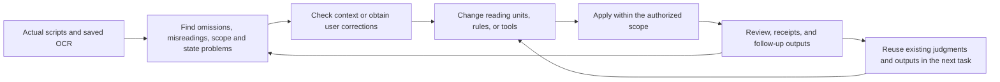

# How the workflow changed while processing scripts

[한국어](../korean/history/evolution.md)

[History](README.md) · [Map of problem branches and output merges](HISTORY.md#history-map)

VOKU's practical problem was to preserve old broadcast scripts while preparing images and text for public access. OCR was the starting point for search and name reading, but unlike structured contacts, names required context from broadcasting roles, self-introductions, quotations, people with the same name, cancellation marks, and handwriting. The initial plan broadly separated roster building → candidate collection → human decisions → redaction, but actual work did not finish in one pass through that diagram. [E01](reference/evidence.md#e01)

The diagram below is **this retrospective's summary** of the observed iteration. It was not an original runner or fixed DAG.

## 1. Would more OCR solve the problem?

Of 131 name corrections in early human review, 61 were already present in one of the two existing OCR sources. Candidate extraction, segmentation, coordinates, and identity resolution needed to be separated before rerunning OCR. Limited OCR retries improved some forms but did not increase the existing recovery of 440 targets in a replay evaluation of 513 known cases. A complete identity-reconstruction run was also a different result from completed image redaction. [Case 1](cases/01-ocr-and-identity.md)

The record retains both attempts of large-scale identity reconstruction (P0-4.5v2), preparation of a blind image pilot, misreadings in direct image reading, and false negatives in the roster-integration verifier.

## 2. More workers did not mean less repeated judgment

There are records of actual image-subagent operations and stops. Later, the user requested less time spent on repeated reading, JSON writing, and handoff explanations. In the main name processing, all unsubmitted scripts in the same year, semester, and program unit became the unit of semantic judgment, with two independent execution sessions sharing a database and identity authority. Vision, rendering, and export processes were separate mechanical work. A fixed Planner/Worker/Reviewer organization cannot describe every period. [Case 2](cases/02-reading-and-state.md)

Agents handled state investigation, cause analysis, code changes, regression checks, grouped questions, precise stop positions, and correction integration as well as name discovery and classification. The human also directly corrected misreadings, omissions, appearance, and application scope rather than only designing the process. Each judgment was consumed as **the next decision statement, coordinate, question, receipt, or code change**.

## 3. Follow-up paths diverged according to the cause of a hold

Geometric failures and unresolved meaning remained after first-pass submission. The app for viewing already generated images and the app for viewing held originals covered different populations. Small shortened-name repairs reused existing identities, while early-year and later-year holds were processed under different conditions. One later-year package implemented several mechanical fixes but remained a partial run. A later separate package completed independent outputs for 2,230 pages after the user narrowed reading to held pages. [Case 3](cases/03-review-and-repair.md)

A review-app bbox could be a location pointing to a problem, and the `name` field did not always contain a confirmed person name. Saved human feedback became input for new reading and correction decisions, not automatic masks. Version management was also needed to keep an old `ok` from becoming approval of a changed image.

## 4. Redefining scope also changed the tools

For approval cells, an application that followed ink outside the stamp area was rolled back, and scope narrowed to specified cell interiors. Adding cell 7 later was a new scope change. For contacts, broad redactions from coordinates proportional to OCR line width were corrected; when the discovery ledger differed from actual masks, image differences recovered physical regions. Human location guides, geometric search regions, and final masks were distinct. [Case 4](cases/04-approval-and-contacts.md)

## 5. Combining outputs required restoration regions as well as erasures

Independent outputs started from a shared original but did not all contain the same revision history. The user specified that upper-priority correction regions should take precedence while preserving other lower-layer name masks. Name layers were combined first, followed by approval cells and contacts. Selecting the latest complete image or combining only difference pixels could lose an intended restoration. [Case 5](cases/05-composition.md)

## 6. History and OCR were reconciled again after final composition

A token-size edit missed 8 historical tokens absent from the latest receipt. When the user asked why, earlier revision history and backups were replayed to establish the cause, and only those 8 specified tokens were corrected. OCR was subsequently generated afresh from final images, and only the corresponding documents' OCR was updated for selected name and contact corrections. Each partial update preserved untargeted pages within the same document JSON and all other documents. [Case 6](cases/06-history-and-final-ocr.md)

## What was automatic and what required judgment?

| Work | What required judgment | What the code consumed |
|---|---|---|
| Name reading | Whether it was a name, staff/private/public classification, whether it was the same person, and the name/address-form boundary | Original quotations, classification, existing ID links, and unresolved reasons |
| Repair | Omissions, excessive redaction, wrong tokens, orientation, and whether to restore | Specified pages, resolved regions, and exceptions to preserve |
| Execution management | Whether new evidence existed, whether to change scope, and where to stop | Formal submissions, ownership, state, and checkpoints |
| Coordinates and rendering | Selective inspection of ambiguous strokes, rotation, and boundaries | Measured coordinates, erasure/token boxes, and layer order |
| Verification | Redefining problems missed by automatic checks | Hashes, pixels outside authorized regions, scope/set checks, and current-version checks |

This table is not a permanent human/AI role assignment. In practice, the same kind of judgment was made by a human or agent at different times.
