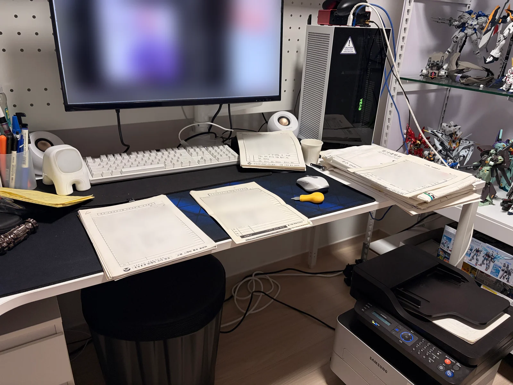
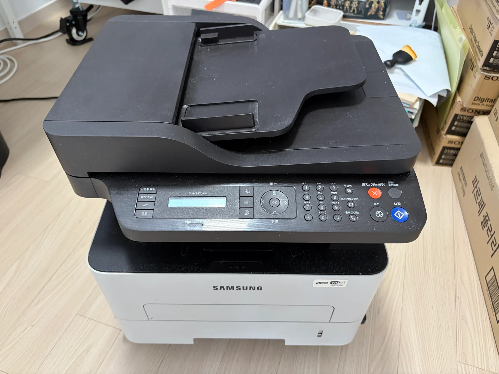
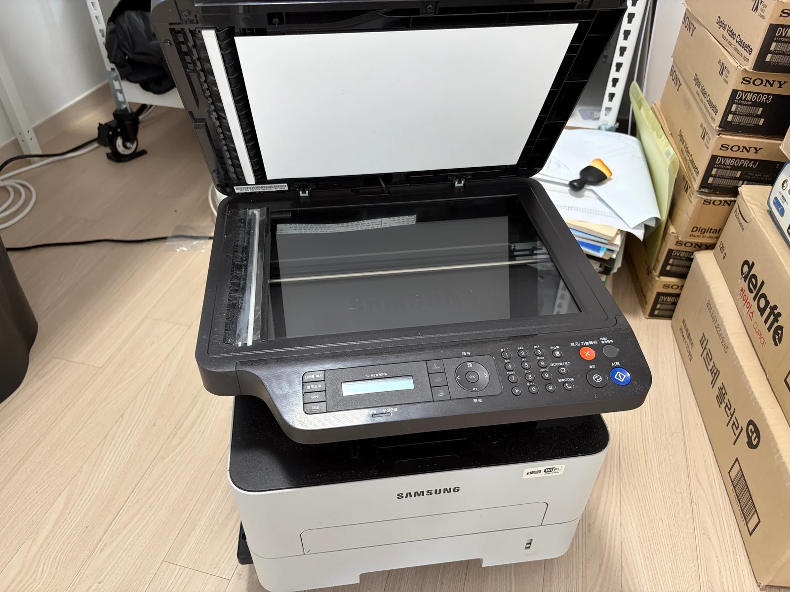
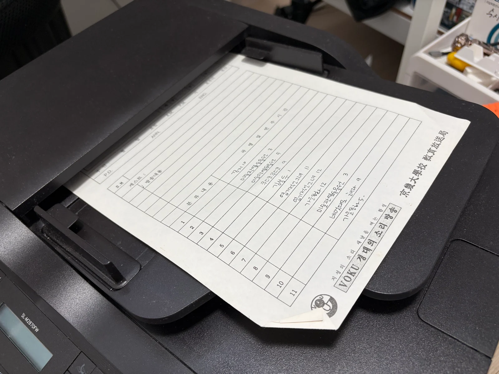

# Scanning workspace

[한국어](../../korean/history/photos/scanning.md)

[Photo index](README.md) · [History](../README.md) · [Project introduction](../../README.md)

Scripts were opened on the desk at home and scanned one page at a time with a multifunction printer. These photographs show the equipment and the space where the paper was handled.

|  |  |
|---|---|
| Work desk with scripts and scanner | Multifunction printer used for the work |

|  |  |
|---|---|
| Open scanner glass and controls | Cue sheets on the feeder |
