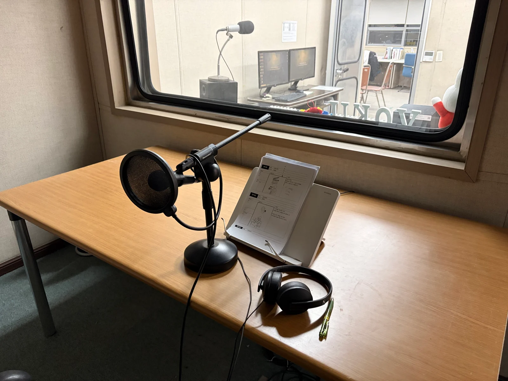
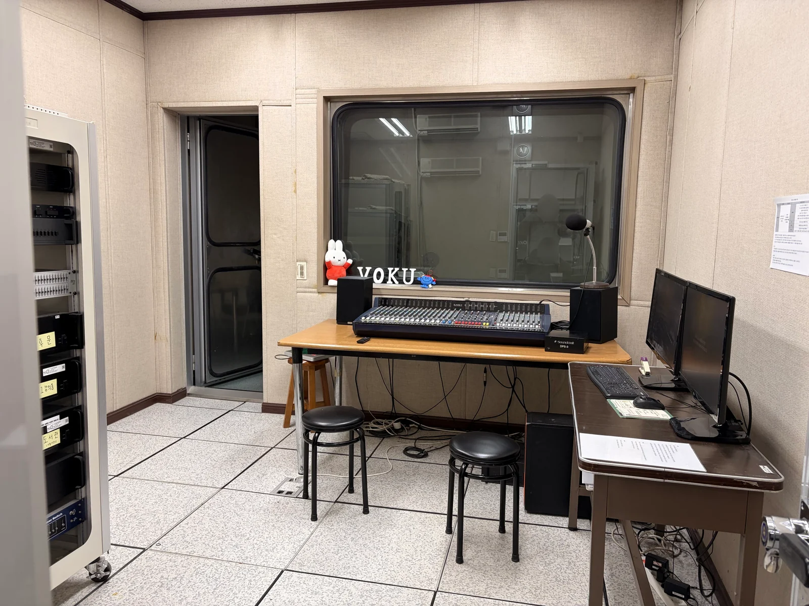
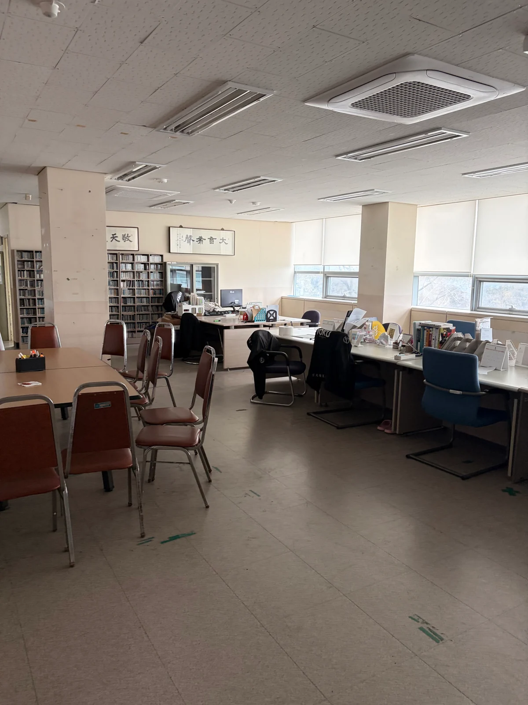
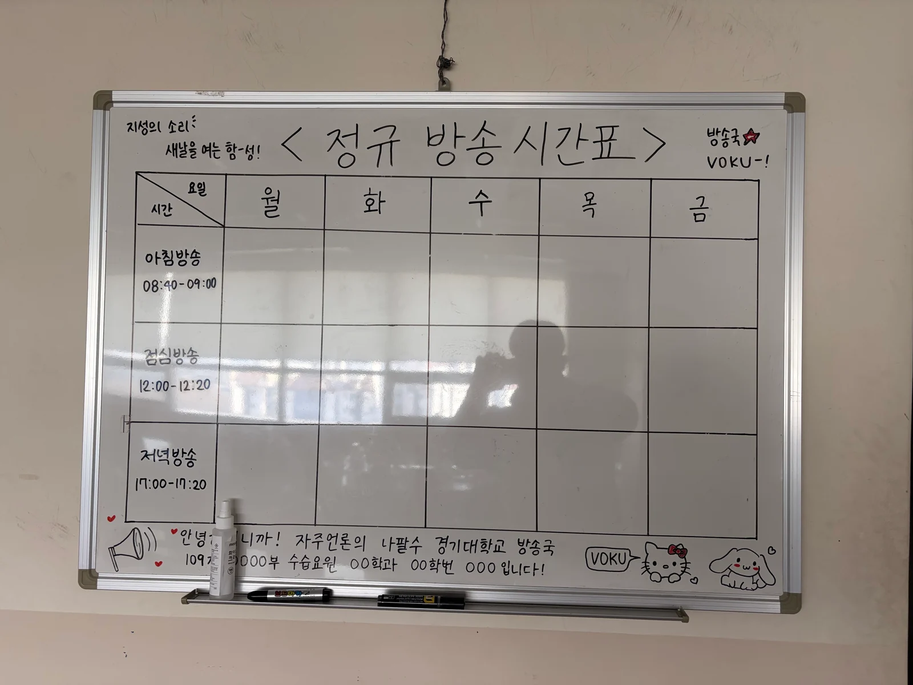
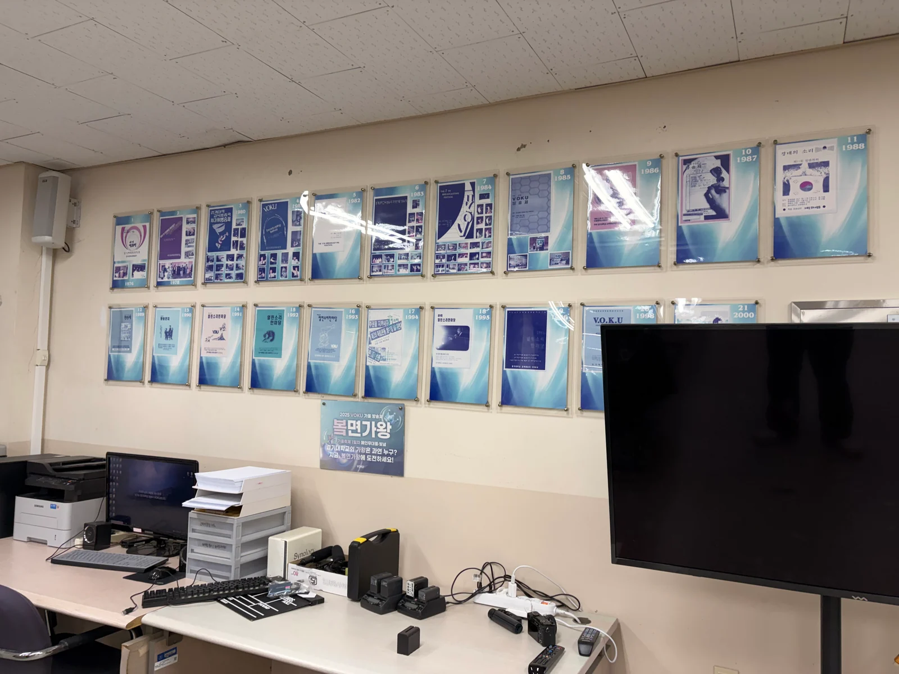
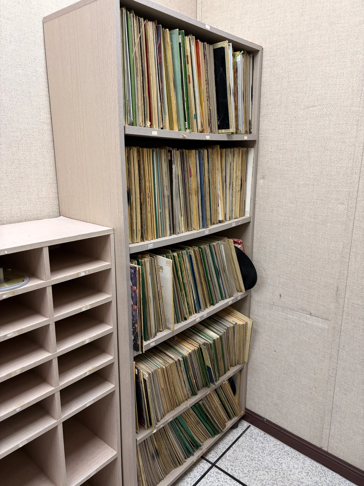

# Station spaces

[한국어](../../korean/history/photos/station.md)

[Photo index](README.md) · [History](../README.md) · [Project introduction](../../README.md)

Spaces and related materials at the broadcasting station where the cue sheets were made and stored.

|  |  |
|---|---|
| Microphone and script stand in the announcer booth | Recording-room entrance and control equipment |

|  |  |
|---|---|
| Station lobby and desks | Regular broadcast schedule |

|  |  |
|---|---|
| Broadcast festival pamphlets collected on a wall | Bookshelves storing LP records |
