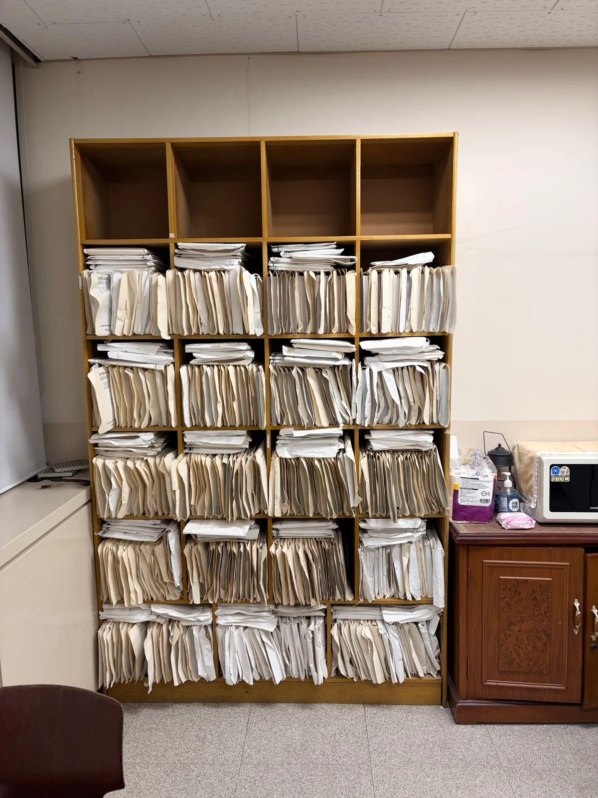
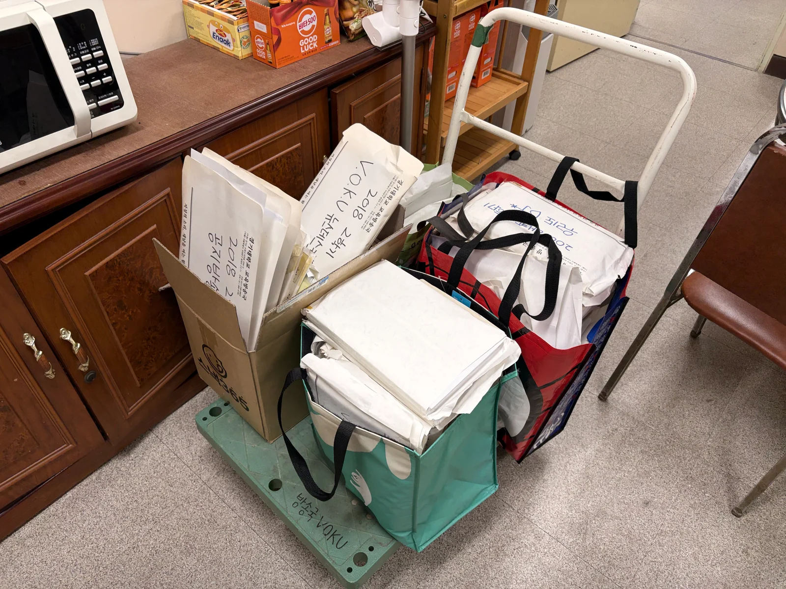
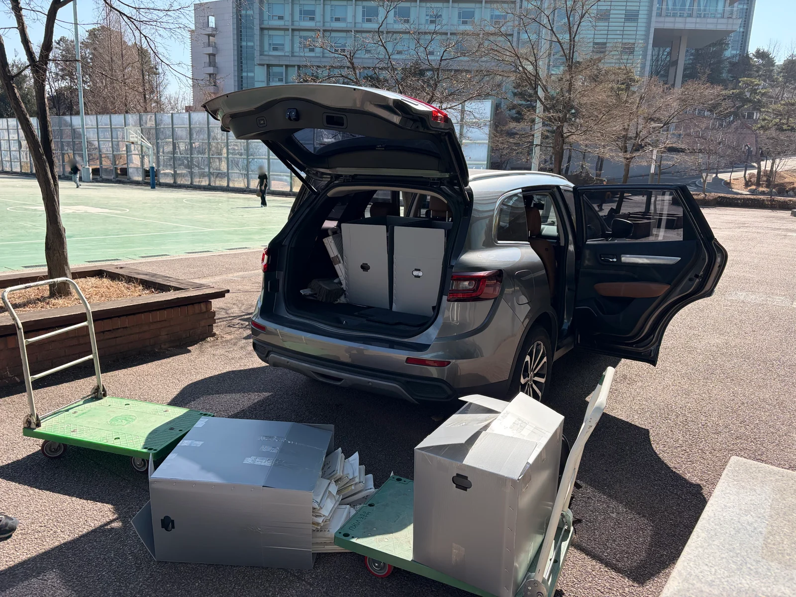

# Bookshelf and transport

[한국어](../../korean/history/photos/transport.md)

[Photo index](README.md) · [History](../README.md) · [Project introduction](../../README.md)

Paper folders from the bookshelf were packed into boxes and bags. A cart and a senior alumnus's car were used to transport the materials home.

|  |  |
|---|---|
| Cue sheets stacked on station bookshelves | Transport cart loaded with boxes and bags |

Car and cart loaded with cue-sheet boxes
