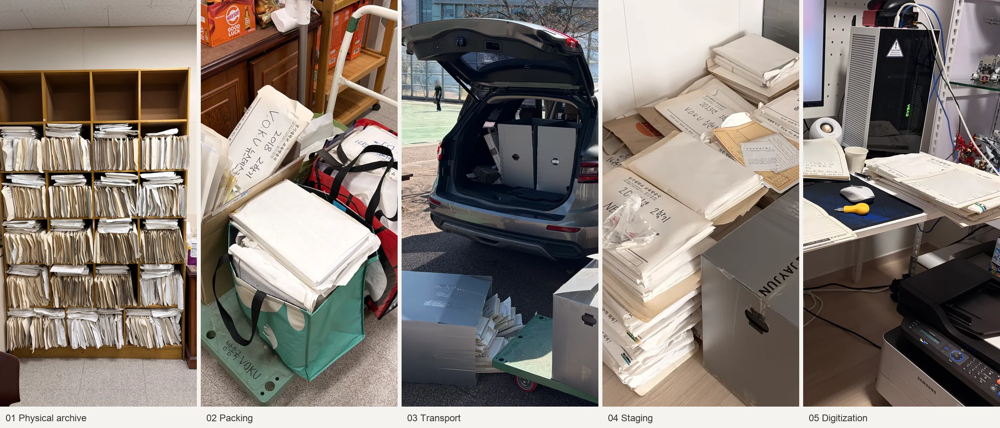

# VOKU Archive

[English](../README.md)

VOKU(Voice of Kyonggi University)는 학생들이 운영하는 대학방송국으로, 라디오 방송뿐 아니라 영상 제작, 무대·행사 제작 및 운영 등 여러 방송·제작 업무를 수행합니다. 이 아카이브는 그중 학생들이 제작한 교내 라디오 방송의 큐시트를 다룹니다. VOKU Archive는 방송국에서 내부 제작한 **1988–2019년, 32년치 큐시트 66,010페이지**를 디지털로 옮기고 공개를 위해 정리한 개인 프로젝트입니다.

이 저장소에는 그 과정의 **Workflow, History, 세 회차 실행 데모, 검토 웹앱**을 담았습니다. 원고에서 보호할 부분을 가리는 한편, 같은 제작자의 반복 참여와 회차별 공동 제작 관계를 가능한 범위에서 가명 토큰으로 남겼습니다. 판단과 처리, 검토와 수정이 실제로 어떻게 이어졌는지 설명합니다.

책장 → 포장 → 운반 → 집에서 보관 → 스캔. [실물과 작업 공간 사진 18장](history/photos/README.md)

## 어디부터 읽으면 되나요

- [Workflow](workflow/README.md): 전체 작업 방식의 진입점. [사람과 에이전트의 판단·수정](workflow/human-agent-workflow.md)과 [자료·결과의 연결](workflow/pipeline.md)을 따라갑니다.
- [세 회차 실행 데모](workflow/demo.md): 1994·2003·2017년 **49쪽 / 53면**의 입력·결과·판단·보정·OCR을 봅니다.
- [공개 검토 웹앱 안내](workflow/assets/human-review/README.md) · [앱 HTML](../workflow/assets/human-review/index.html): 데모 중 **8면**을 비교하고 의견을 남기는 정적 샘플. 저장소를 내려받아 자기 환경에서 실행할 수 있습니다.
- [History](history/README.md): 당시의 사건·실패·변경·근거를 보존한 기록. Workflow의 사례별 링크에서도 해당 근거로 내려갈 수 있습니다.
- [Hugging Face의 VOKU Archive 데이터셋](https://huggingface.co/datasets/NewTypeCola/VOKU-Archive): 정리된 66,010페이지의 이미지·OCR·토큰 annotation을 제공합니다.

## 왜, 어떻게 만들었나요

과거 방송국 소속이었던 저는 선배들이 만든 큐시트가 창고에 방치된 채 남아 있지 않았으면 했습니다. 방송을 준비하며 쓴 문장과 손글씨, 담당자를 바꾼 흔적이 종이 폴더 안에 쌓여 있었습니다. 그 자료를 꺼내 읽을 수 있는 형태로 옮기는 일도 일종의 방송이라고 생각했습니다.

책장에 있던 큐시트를 상자와 가방에 나눠 담고 카트로 옮겼습니다. 선배의 도움으로 자동차에 실어 집으로 가져왔습니다. 거실과 방, 현관에 자료를 나눠 보관하고, 작업 책상에서 원고를 펼쳐 복합기로 한 장씩 스캔했습니다. [운반 사진](history/photos/transport.md), [집에서의 보관](history/photos/storage.md), [스캔 작업 공간](history/photos/scanning.md)에 그 과정을 남겼습니다.

스캔은 2026년 2월 17일 시작해 6월 6일에 끝났습니다. 스캔과 1차 분류를 마친 뒤에는 번아웃으로 약 두 달을 쉬었고, 8월 15일부터 작업을 다시 이어갔습니다. 혼자 Codex(GPT-6 Astra)를 사용해 마스킹·토큰 파이프라인을 계획하고 실행했으며, 9월 25일 이번 처리분을 마무리했습니다.

비용은 전부 사비로 부담했습니다. 큐시트 상자를 함께 날라 준 선배에게 고맙습니다. 위 일정과 경위는 제작자가 확인한 설명이며, 당시 코드·기록으로 확인한 처리 과정은 [Workflow](workflow/pipeline.md#source-and-ocr)와 History에서 이어집니다.

## 공개 범위와 남은 한계

이 저장소는 **66,010페이지 전체 데이터셋의 배포처가 아닙니다.** 공개 파일은 설명 문서, 선별 코드, 정리한 현장 사진, 개인 식별정보를 가상화한 데모와 검토 웹앱이며 [공개 파일 목록](../public-files.txt)으로 관리합니다. 실제 원고 전체의 이미지·OCR, 운영 DB, 실명 대응표와 비공개 검토 기록은 포함하지 않습니다. 처리 대상과 집계의 상세 기준은 [History의 범위와 집계](history/reference/status-and-counts.md)에 있습니다.

분류·인물 연결·영역 처리·OCR에는 오류가 남을 수 있습니다. 마스킹과 토큰은 완전한 익명화나 제작 관계의 완전한 복원을 보증하지 않습니다. 9월 25일은 로컬 처리의 마무리 시점이며, 기술 검증·사람의 검토·공개 판단·실제 배포는 구분합니다. 이번 저장소 편집의 확인 결과는 [공개본 검증 기록](history/reference/publication-check.md#current-edition)에 남겼습니다.

검토 웹앱은 자기 환경에서 열어보는 공개용 도구 샘플이며, 제작자가 직접 호스팅해 운영할 계획은 없습니다. 별도 로그인·운영 DB·API 키 없이 동작하고, 새 의견은 사용자의 브라우저 저장소에만 남습니다. 실행 방법과 저장 동작은 [웹앱 안내](workflow/assets/human-review/README.md#로컬에서-실행)에 있습니다.

## 누구의 프로젝트이며, 원본은 어디에 있나요

**제작자 크레딧: Jeoung Geunyeong** — 과거 방송국 소속으로, 이 디지털 아카이브를 개인 프로젝트로 제작했습니다.

**동문회의 허락을 받아 개인이 주도한 프로젝트**입니다. 학교가 주도하거나 지원한 사업은 아닙니다. 동문회의 허락이 모든 제작자의 개별 동의나 원고 전체의 권리 확보를 뜻하지는 않습니다. 물리적 원본 종이는 현재 대학방송국에 다시 보관 중입니다.

이 저장소의 공개 자료에는 **MIT-0**을 적용합니다. 출처 고지 없이 이용·수정·재배포할 수 있습니다. 자료 종류별 적용 범위와 별도 원고·제3자 권리의 구분은 [LICENSE](LICENSE.md), 보존 코드의 출처와 외부 구성요소는 [NOTICE](NOTICE.md)에 정리했습니다.

🎵 *If I Didn't Have You* — 읽어주셔서 감사합니다.
