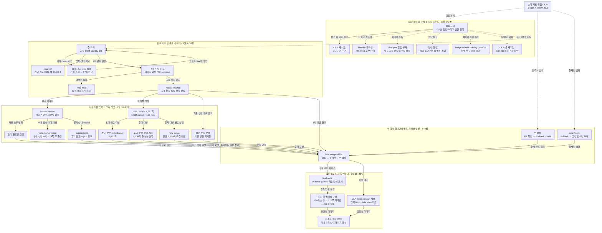

# VOKU Archive History

[English](../../history/HISTORY.md)

**66,010쪽의 원고를 처리하면서 무엇이 막혔고, 그때의 판단과 결과가 다음 작업에 어떻게 전달되었습니까?** 이 문서는 실제 처리 기록을 연결한 History입니다.

먼저 여섯 시기의 설명을 읽고, 구체적인 전환은 사례로 따라갈 수 있습니다. 아래의 [세부 연표](#timeline)는 각 사건이 남긴 입력·결정·도구를 함께 기록합니다. 날짜는 작업 기록의 현지 시각을 기준으로 하며, 겹쳐 진행한 갈래는 같은 기간에 놓았습니다.

## 1. 입력을 모으고 연락처부터 처리하다 — 6월~8월

출발점에는 서로 다른 폴더에 흩어진 PDF, WebP, OCR JSON이 있었습니다. 6월 8일의 취합 도구와 manifest는 이미 만들어진 자료를 연도별 작업 집합으로 모은 흔적입니다. 이후 숫자 연도 1988–2019의 5,330문서·66,010쪽과 Unknown 389문서·4,413쪽을 구분해 처리했습니다. 저장 OCR은 검색 가능한 텍스트이자 다음 이름 판독의 입력이었지만, 생성이 끝난 문서에도 REVIEW와 FAIL 상태가 남았습니다. [E02](reference/evidence.md#e02)

전화·메일처럼 비교적 정형적인 대상도 문자열을 찾는 것만으로 끝나지 않았습니다. 넓은 OCR 줄을 채운 Fill은 주변 문맥을 지우면서도 일부 연락처를 놓쳤습니다. 새 OCR의 `nilError`와 0-line을 잔여 없음처럼 읽은 문제도 있었습니다. 복원 뒤 흰 바탕·검은 테두리 방식으로 바꾸었고, 불확실한 후보와 실제 승인 적용을 나누었습니다. Unknown의 18쪽 OCR 연결을 되찾는 일도 별도로 진행됐습니다. [E03](reference/evidence.md#e03)

공개용 텍스트를 만드는 계획도 바뀌었습니다. 원 OCR의 민감 표기를 치환하면 최종 이미지의 실제 수정과 어긋날 수 있었습니다. 8월 21일 수정안은 최종 WebP를 다시 OCR하고, 옛 OCR은 매핑과 검증 근거로 남기도록 했습니다. 이 결정은 그때 바로 전체 실행으로 이어진 것이 아니라, 9월 말 최종 이미지 OCR에서 실현됐습니다. [사례 6](cases/06-history-and-final-ocr.md)

## 2. 이름 누락을 하나의 OCR 문제로 풀 수 없었습니다 — 8월 24일~9월 초

513건의 사람 검토를 분석하자 정정된 이름 131건 중 61건이 기존 OCR에 이미 있었습니다. 새 인식을 더하기 전에, 보이는 표기를 후보로 회수했는지, 누구와 연결했는지, 사람 분류와 보호 범위를 제대로 표현했는지 따져야 했습니다. 일반 비스태프 인명을 설명한 메모가 공개 인물 제외 상태와 함께 저장된 일은 검수 양식 자체에도 문제가 있음을 보여줬습니다. [E04](reference/evidence.md#e04)

인쇄체 13건과 필기·혼합 56건의 제한 재OCR는 표기를 일부 복구했습니다. 그러나 복구 OCR을 붙인 513건 재생에서 기존 대상 440건은 유지됐고 새 대상 노출은 0건이었습니다. 복구 결과는 기존 관측을 덮어쓰지 않는 추가 근거가 됐습니다. 한편 대규모 신원 재구성 (P0-4.5v2)은 숫자 연도 66,010쪽과 Unknown 4,413쪽을 포함한 70,423쪽 범위에서 신원 관계를 재구성했고, 소속 미확정과 불완전한 동명이인 조합을 다시 분류했습니다. 이어진 semantic repair는 후보·소속·신원 가설·QA 표시를 나누었습니다. [E05–E07](reference/evidence.md#e05)

직접 이미지 판독과 검증기에도 문제가 남았습니다. blind pilot은 100개 방송·270쪽 입력을 준비했으나 응답 경로가 완성되지 않았습니다. 별도의 이미지 판독에서는 같은 오독을 반복하다 사용자의 음절 지적 뒤 정정했습니다. 명단 병합에서는 생성기와 evaluator가 입력의 미완료를 함께 놓쳐, 57개 시험과 첫 검증 주기 통과 후 실행을 중단했습니다. 각 갈래가 남긴 것은 복구 관측, 후보 신원 구조, 검토 자료, 중단 보고입니다. 이 모두를 하나의 마스킹 성공으로 묶을 수는 없었습니다. [사례 1](cases/01-ocr-and-identity.md)

## 3. 판독 단위와 실패를 되돌려 보내는 위치를 바꾸다 — 9월 5~10일

9월 초에는 여러 방식이 실제로 나란히 시도됐습니다. 이미지 작업자는 원본 확인부터 bbox·적용·결과 검토까지 맡았고, 선별 오버레이 처리 (overlay)는 짧은 제작진 표기를 선별에서 놓쳐 규칙을 보완했습니다. 저장 OCR만 쓰는 별도 경로는 이름 좌표 대신 줄 전체를 다시 그리기도 했습니다. 사용량 중단, 실제 결과와 작업자 보고의 불일치, 완료본 취합 과정의 승인 연결 복구가 각각 다른 문제로 나타났습니다. [사례 2](cases/02-reading-and-state.md)

52쪽 격리 시험은 네 문서 모두 보류로 끝났지만 그 뒤의 기록도 남아 있습니다. 저장된 판독을 재사용하며 회전·옅은 이웃 획·토큰 배치를 고쳤고, 새 17쪽 시험에서는 작업 범위 밖의 제한된 OCR을 신원 근거로 연결했습니다. 일곱 번째 실행에서 17쪽을 마친 뒤 코드와 회귀 자료만 운영 패키지에 반영했습니다. 테스트에서 만든 신원·토큰·완료 DB는 합치지 않았습니다. 단일 에이전트 대체본 `read-v2` 역시 제작 뒤 실제 판독을 시작했습니다. 첫 한 쪽의 좌표 실패 뒤 사용자가 텍스트 단계만 진행하도록 바꾸어 추가 84쪽을 제출했습니다. [E27–E28](reference/evidence.md#e27)

주 처리에서는 편성 소유권과 실제 판독 범위의 불일치가 드러났습니다. 한 편성을 소유해도 packet은 기본 두 회차·45,000자로 잘렸습니다. 9월 8일에는 같은 연도·학기·편성의 미제출 회차 전체를 한 번에 판단·제출하도록 바꾸고, 집계와 인계 문장은 코드가 만들게 했습니다. `read-next`는 이 개선된 주 처리를 복사해 세션 입력으로 다듬은 별도 갈래였으며, 9월 9일 7문서·82쪽을 실제 제출한 뒤 검토 단계에 남았습니다. 주 처리는 공용 신원·토큰을 쓰는 양방향의 두 독립 판독 세션 (main/reverse)으로 이어져 5,330문서의 공식 제출을 마쳤습니다. [E12–E13](reference/evidence.md#e13), [E29](reference/evidence.md#e29)

## 4. 보류와 검수 문제를 서로 다른 후속 작업으로 나누다 — 9월 10~20일

1차 결과의 partial/hold 4,287쪽 중 2,768쪽은 기계 문제만, 1,087쪽은 의미 문제만, 426쪽은 둘 다, 6쪽은 빈 OCR이었습니다. 완료 이미지를 보는 사람 검수 앱의 문제 페이지와, 아직 정상 결과가 없는 보류 페이지는 다른 집합이었습니다. 사용자는 기존 패키지가 빠른 1차 처리용이라고 정정하고 재작업은 독립적으로 설계하도록 했습니다. 이미 소진된 연도 배정으로 과거 보류를 다시 열면 소유 범위 검사에 막히는 문제도 있었습니다. [E30](reference/evidence.md#e30)

초기 완료본 교정, 초기 연도 보류, 후기 보류가 서로 다른 입력과 상태를 가지게 된 이유가 여기에 있습니다. 짧은 호칭 보정은 기존 인물 연결을 유지한 채 기하만 풀었습니다. 후기 보류 첫 패키지는 복원이 다른 마스크를 되살리는 문제, 범위 변경 뒤 캐시 재사용, 신원 연결 변경으로 좌표까지 버리는 문제를 고쳤지만 부분 실행에 머물렀습니다. 같은 후기 2,230쪽은 이후 후기 보류 해소 경로 (`new-boryu`)에서 별도 완료됐습니다. 그 과정에도 매 페이지 이미지 확인을 요구하던 방식에서 사용자가 원하는 보류 페이지 OCR 중심 1차 처리로 바뀌는 전환이 있었습니다. [사례 3](cases/03-review-and-repair.md)

추가 조사에서 확인한 이름 누락 보정 경로도 있었습니다. 2000–2019 계획 패키지는 빈 메모·bbox 없는 `needs_review`를 놓쳐 사람 문제를 3쪽으로 잘못 셌습니다. 저장 이력을 재생한 뒤 1,805쪽으로 바로잡았고, 후기 이름 누락 보정 경로 (`voku-name-repair`)로 옮겨 OCR 우선 보정을 진행했습니다. 과거 영수증의 `token_layout=null` 때문에 렌더러가 멈추자, 토큰이 없더라도 이름을 지운 영역은 보호해야 한다는 호환 처리를 넣었습니다. 저장된 마지막 STOP 보고는 51/457편성, 현재 남은 출력은 279쪽입니다. 이 갈래를 후기 보류 전체 완료나 최종 합성 레이어와 합치지 않습니다. [E31](reference/evidence.md#e31)

## 5. 처리 범위를 다시 정하고 독립 결과를 합치다 — 9월 중순~23일

결재란은 외부 잉크를 따라간 2,632쪽 적용을 사용자 요청으로 되돌린 뒤, 고정 칸 내부를 찾는 문제로 바뀌었습니다. 그 후 7번 칸 추가와 서식 경계 수정이 이어졌습니다. 연락처에서는 더 밀착된 마스크를 만들려다 발견 원장 108행과 실제 지운 영역이 맞지 않는 문제가 드러나, 원본과 결과의 변경 픽셀로 물리적 마스크를 복원했습니다. 사용자의 범위 결정에 따라 코드가 풀어야 할 기하 문제도 달라졌습니다. [사례 4](cases/04-approval-and-contacts.md)

검토 결과는 다시 작업 입력이 됐습니다. 후기 이름 보정 경로 (supplement)는 최초 needs_review 3,646쪽에 issue와 새 bbox 대상이 더해졌고, 별도 검토 앱의 export를 다시 받아 수정했습니다. 합성 뒤 이름 누락 감사 (`tri-force-gumsu`)에서는 결재란 처리 페이지 목록을 이름 감사의 범위로 삼았습니다. 이 조사에서 저장된 최종 결과는 이름 누락 확인 1,137쪽이었습니다. 이어지는 270쪽 기하 초안은 중단됐고, 이미 처리한 106쪽과 겹치는 41쪽을 뺀 229쪽 가이드 검토를 거쳐 201쪽의 수정이 실제 적용됐습니다. 발견 목록, 검토 범위, 최종 적용 수가 각각 다른 이유입니다. [E19](reference/evidence.md#e19), [E32](reference/evidence.md#e32)

서로 다른 보정본을 합칠 때는 최신 이미지 하나를 고를 수 없었습니다. 상위 보정본이 이름 하나를 복원하면서 다른 것을 지웠다면, 원본과 다른 픽셀만 합치는 방식으로는 복원이 전달되지 않습니다. 사용자는 하위의 다른 수정을 보존하며 상위의 수정 영역을 우선하도록 정했습니다. 합성기는 지움·토큰·복원 영역을 받아 이름→결재란→연락처 순서로 66,010쪽을 만들고, 후속 보정은 지정된 페이지에 다시 전달했습니다. [사례 5](cases/05-composition.md)

## 6. 현재 이미지와 과거 이력, OCR을 다시 맞추다 — 9월 23~25일

합성 뒤의 토큰 서식 수정에서도 과거 이력이 필요했습니다. 최신 영수증만 읽은 준비 로직이 이전 supplement에서 들어온 토큰 8개를 빠뜨렸습니다. 사용자가 미수정 이유를 먼저 요구하자, 이전 revision과 백업을 재생해 목록에서 빠진 경위를 확인했습니다. 그 뒤 해당 한 쪽의 8개만 2+2글자·13px로 고쳤습니다. 다른 시점의 private 보호 영역과 최신 토큰의 충돌도 단순 합집합 대신 수정 순서를 읽어 해결했습니다. [E25](reference/evidence.md#e25)

8월의 최종 이미지 우선 OCR 계획은 이 시기에 실제 전체 생성으로 이어졌습니다. 66,010쪽·5,330문서의 두 번의 OCR 뒤에도 지정 이름 62쪽과 연락처 52쪽의 수정에 맞춰 해당 회차 JSON을 갱신했습니다. 같은 JSON 안의 비대상 페이지와 나머지 회차는 보존했습니다. 파일명 정규화 때문에 검증이 실패했을 때는 파일을 다시 만들지 않고 동일 파일 대조를 고쳤습니다. 빈 원본 7쪽과 경계 밖으로 조금 나간 OCR 좌표는 각각 사용자 확인과 원값 보존으로 처리했습니다. [E24](reference/evidence.md#e24)

마지막 상태는 현재 이미지 집합, 그 이미지에서 생성한 OCR, 국소 교정 영수증, 검토 상태가 연결된 결과입니다. 과거 최상위 manifest와 현재 이미지가 다른 표본은 후속 수정 이력으로 설명됩니다. 입력한 bbox만 적용한 15쪽 수정에서는 영역 밖 잔획을 임의로 넓혀 가리지 않았습니다. 마지막까지 완료의 단위와 수정할 범위를 구체적으로 남기는 일이 필요했습니다. [사례 6](cases/06-history-and-final-ocr.md)

## 용어표

| 용어 | 이 History에서의 뜻 |
|---|---|
| 편성 | 같은 연도·학기·프로그램으로 묶인 작업 단위. 여러 회차의 인물 문맥을 함께 읽는 기준이 됐습니다. |
| 회차 | 한 번의 방송에 해당하는 원고 묶음. 문서 한 개에 여러 페이지가 들어갈 수 있습니다. |
| packet | 에이전트에 전달하는 OCR·참조·작업 범위 묶음. 두 회차씩 잘라 전달하던 시기와 편성 전체를 전달하던 시기가 있습니다. |
| identity | 여러 이름 표기와 등장 위치를 같은 인물로 연결한 신원 판단 및 기록. |
| token | 이름을 대신해 이미지에 넣는 표식. 기존 인물 연결과 token의 대응을 후속 작업에서도 보존했습니다. |
| geometry | 글자의 방향·위치·획과 지움·복원·token 영역을 좌표로 다루는 처리. |
| hold | 의미 판단이나 기하 처리 등의 미해결 문제를 남긴 보류 상태. 문서와 페이지의 보류 범위를 구분해 읽습니다. |
| partial | 페이지 처리 일부가 진행됐지만 미해결 부분이 남은 상태. 출력이 있는 partial도 있었습니다. |
| receipt | 적용한 결정·영역·입출력·검증 결과 등을 연결하는 영수증. 다음 보정이나 합성에서 앞선 처리를 읽는 근거가 됐습니다. |
| remediation | 기존 결과와 판단을 바탕으로 누락·과잉·보류 등의 구체적 문제를 보정하는 후속 작업. |
| production | 시험이나 패키지 제작을 넘어 실제 아카이브 대상에 적용한 운영 실행. 부분 실행도 그 범위를 따로 기록합니다. |
| stale state | 뒤의 실행이나 교정을 아직 반영하지 못한 과거 상태 기록. 작성 시점과 현재 파일·후속 영수증을 함께 대조합니다. |

## 전체 History 마인드맵 — 문제의 분기와 결과의 합류

아래 지도는 서로 겹쳐 진행한 문제 갈래와 실제 결과 전달을 보여줍니다. 합류를 표현하기 위해 Mermaid flowchart 문법을 사용했습니다. **점선은 같은 자료·문제를 다룬 갈래**, **실선은 기록으로 연결된 입력·결정·코드·결과의 전달**입니다. 선의 문구가 무엇이 넘어갔는지를 설명합니다. 점선은 버전 계보가 아니며, 끝에 남은 중단·부분 결과는 후속 채택이 확인된 곳에만 연결했습니다.

지도의 판독 분기는 [사례 1](cases/01-ocr-and-identity.md)·[사례 2](cases/02-reading-and-state.md), 후속 입력의 분리는 [사례 3](cases/03-review-and-repair.md), 범위 변경과 합성은 [사례 4](cases/04-approval-and-contacts.md)·[사례 5](cases/05-composition.md), 마지막 교정과 OCR은 [사례 6](cases/06-history-and-final-ocr.md)에서 확인할 수 있습니다. 단일 에이전트 판독 대체본 (read-v2)과 세션 입력 대체본 (read-next)는 각각 주 처리에서 갈라졌으며, 둘 사이의 승계나 주 처리 역이관은 확인되지 않았습니다. 지도에 합류선이 없는 별도 결과도 아래 연표와 사례에 보존했습니다.

## 세부 연표 — 다음 단계에 남긴 것

| 시기 | 문제와 당시 선택 | 실제 결과 | 다음 단계에 남긴 것 | 근거 |
|---|---|---|---|---|
| 6/8 | 기존 PDF/WebP/OCR 취합 | 복사 manifest와 연도별 자료 | 이후 입력 집합과 출처 연결 | [E02](reference/evidence.md#e02) |
| 6~8월 | 연락처 Fill의 과잉·누락, 실패 OCR 해석 | 복원 보고와 outlined 마스크 | 승인 영역별 적용, 원본/결과 대조 | [E03](reference/evidence.md#e03) |
| 8월 중순 | 불확실 후보와 실제 처리 구분 | 일부 승인 적용, false positive/noaction | 미해결 후보를 별도 검토 입력으로 보존 | [E03](reference/evidence.md#e03) |
| 8/21 | 원 OCR 치환과 최종 이미지 불일치 | 최종 WebP 새 OCR로 계획 수정 | E24의 전체 OCR 실행 기준 | [E02](reference/evidence.md#e02) |
| 8/24 | 사람 정정이 기존 OCR에도 있음 | 131정정 중 61건 기존 인식, 70건 양쪽 미탐 | extraction·reconciliation과 재OCR 실험을 분리 | [E04](reference/evidence.md#e04) |
| 8/25 | 인쇄 13·필기/혼합 56건 복구 | 표기 개선, 기존 440대상 유지·새 노출 0 | 덮어쓰지 않는 추가 관측과 별도 HOLD 노출 문제 | [E05](reference/evidence.md#e05) |
| 8/29 | 동명이인 조합 확대와 불완전 소속 | attempt008 재구성, 1,311 probable 재분류 | 자격 있는 근거만 관계로 만드는 코드 | [E06](reference/evidence.md#e06) |
| 8/29~30 | slot·소속·identity·QA 표시 혼선 | attempt009 99/99, 후보 단계 | 의미 축과 표시 검증을 나눈 후보 구조 | [E07](reference/evidence.md#e07) |
| 8/30 | blind 전체 이미지 판독 준비 | 100방송·270쪽, 응답 없음 | 준비된 입력·수동 실행 안내; 후속 채택 연결은 없음 | [E08](reference/evidence.md#e08) |
| 8/30 | 직접 이미지 판독의 반복 오독 | 사용자 음절 지적 뒤 확대 정정 | 해당 판독 정정과 미완성 명단 작업 | [E08](reference/evidence.md#e08) |
| 9/1 | 생성기와 evaluator의 동일 누락 | Cycle00 무효, Cycle01 중단 | 불완전 입력 검사를 고쳐 새 run을 만들라는 요구 | [E09](reference/evidence.md#e09) |
| 9월 초 | 역할별 명단을 연도 단위로 통합 | 별도 명단 통합·검증 기록 | 연도별 근거와 후보; 최종 명단 전체 승계는 미연결 | [사례 1](cases/01-ocr-and-identity.md) |
| 9/5~6 | 이미지 작업자 운영·제한 모델 시험 | 실제 dispatch/중단, 제한 시험은 적용 전 중단 | 부분 작업·기존 토큰·중단 위치 보존 | [E10](reference/evidence.md#e10) |
| 9/5 | 새 OCR·이미지 열람 없는 별도 처리 | 59회차 영수증·644쪽, 출력 210쪽 | 줄 전체 재기입이라는 별도 좌표 타협의 기록 | [E34](reference/evidence.md#e34) |
| 9/6 | overlay 선별의 짧은 제작진 누락 | 55쪽, 후속 896쪽 처리·중단 | 선별 보완, 앞선 부분 결과 재사용 | [E10](reference/evidence.md#e10) |
| 9/6 | 완료본 취합·승인 연결·저장 위치 | 6,920쪽 취합, 67건 연결 복구 후 재배치 | 뒤에서 재사용할 완료본 원장 | [E10](reference/evidence.md#e10) |
| 9/6 | 이미지 작업자 운영 (Luna v3)의 보고/실제 결과 충돌 | 활성 작업 13쪽 마무리, 12 masked·1 hold | 서명/날짜 겹침은 승인 취소→hold로 보존 | [E33](reference/evidence.md#e33) |
| 9/6~7 | 학적 보존 시험 fixture 불일치 | 8개 중 1실패로 그 실행 재개 안함 | 수정해야 할 검증 입력 구조 | [E11](reference/evidence.md#e11) |
| 9/6~7 | 52쪽 시험의 기하/토큰 실패 | 12 verified·30 nochange·8 partial·2 hold | 저장 판독을 고정한 기하 회귀 자료 | [E11](reference/evidence.md#e11) |
| 9/7 새벽 | 회전·옅은 행·신원 문맥 부족 보완 | 7번째 시험에서 17쪽 완료 | 코드/fixture 운영 반영, 테스트 DB 미병합 | [E27](reference/evidence.md#e27) |
| 9/7 | 단일 에이전트 feedback 대체본 | read-v2 구축 후 첫 1쪽 좌표 실패 | 텍스트와 기하 단계를 따로 진행하도록 범위 변경 | [E28](reference/evidence.md#e28) |
| 9/7 저녁 | read-v2에서 텍스트만 진행 | 추가 5문서·84쪽 제출, 다음 packet 열림 | 총 신규 판독 85쪽, 이미지 0·미제출 위치 보존 | [E28](reference/evidence.md#e28) |
| 9/8 | 편성 소유권과 두 회차 packet의 불일치 | 전체 미제출 편성 단위, 47문서·320쪽 제출 사례 | 원자적 의미 판단과 페이지별 처리 큐의 결합 | [E13](reference/evidence.md#e13) |
| 9/8 | 반복 JSON·집계·인계 작성 | 표시 123,095→35,815자, OCR/대안 유지 | compact 읽기와 자동 인계 | [E13](reference/evidence.md#e13) |
| 9/8~9 | 이미 개선한 주 처리의 세션 대체본 | read-next 복사·198검사 후 7문서·82쪽 제출 | 11 verified·64 nochange·7 partial, 검토 단계 보존 | [E29](reference/evidence.md#e29) |
| 9/9~10 | 공용 신원으로 양방향 판독 | main/reverse, 5,330문서 공식 제출 | 4,287쪽 보류와 이전 판단·기하·영수증 | [E12](reference/evidence.md#e12) |
| 9/10 | 1차 큐로 재작업하기 어려움 | 원인 분해·독립 재작업 설계 | 보류 원본과 완료본 issue를 나눈 입력 | [E30](reference/evidence.md#e30) |
| 9/10~13 | 검수·짧은 호칭·초기 연도 교정 | 호칭 9쪽, 완료본 교정 229쪽, 초기 보류 2,057쪽 | 기존 신원과 독립 수정 레이어 | [E14–16](reference/evidence.md#e15) |
| 9월 중순 | 후기 보류의 복원·캐시·토큰 오류 | 현재 18쪽 artifact, 부분 실행 | 복원/허용영역 계약과 좌표·신원 캐시 분리 | [E17](reference/evidence.md#e17) |
| 9/14~15 | 빈 needs_review 누락·후기 이름 보정 | 선정 3→1,805쪽, 이주·null 호환 수정 | 수동 검수 이력 재생, 기존 삭제 영역 보호 | [E31](reference/evidence.md#e31) |
| 9/15 | 이름 보정 경로의 실제 진행·중단 | STOP 보고 51/457편성, 현 출력 279쪽 | 다음 미제출 packet과 부분 결과; 후속 반영 미연결 | [E31](reference/evidence.md#e31) |
| 9/13~22 | 결재란 외부 잉크 rollback→고정 칸 | 2,632쪽 적용 복원, 칸 7 추가, 결과 12,194쪽 | 이후 합성용 결재란 레이어 | [E20](reference/evidence.md#e20) |
| 9/19~20 | 사용자가 빠른 OCR 1차와 직접 최종 검토 선택 | 후기 195+2,035쪽 독립 완료 | held_pages 판독·기존 신원·별도 로컬 결과 | [E18](reference/evidence.md#e18) |
| 9/20~23 | 검토 결과를 수정 입력으로 되돌림 | supplement 현재 3,949쪽, export 76/200/78 연결 | 위치 안내·판독·확정 영역을 거친 보정 | [E19](reference/evidence.md#e19) |
| 9/22 | 연락처 밀착과 원장/픽셀 불일치 | 3,518 refit, 108행 회복, 면적 48.72% 감소 | 물리 영역과 합집합 테두리, 별도 빈틈 감사 | [E21](reference/evidence.md#e21) |
| 9/22 | 빈틈 감사의 선택 적용 | 76쪽·82근거→90영역 | 기존 출력과 합친 연락처 3,594쪽 | [E21](reference/evidence.md#e21) |
| 9/22~23 | 독립 이름·결재·연락처 합성 | 66,010쪽, 무레이어 37,768쪽 복사 | 지움·토큰·복원 영역을 받는 수신 계약 | [E22](reference/evidence.md#e22) |
| 9/23 | 합성 결과의 이름 누락 조사 | 최종 조사 1,137쪽 확인, 당시 수정 0 | 별도 검토 목록과 bbox 가이드 | [E32](reference/evidence.md#e32) |
| 9/23 | 270쪽 초안 중단 뒤 범위 정정 | 229쪽 가이드→28제외→201쪽·394연산 적용 | supplement와 final 양쪽의 같은 제한 보정 | [E19](reference/evidence.md#e19), [E32](reference/evidence.md#e32) |
| 9/23 이후 | 추가 보정의 최종 수신 | 17중16 변경, 1,893중1,892 변경, 후속 1,538+1 | 생산자 기록에 수신측 반영 영수증을 연결 | [E23](reference/evidence.md#e23) |
| 9/23~25 | 최종 이미지와 텍스트 일치 | 두 번 전체 OCR, 62/52쪽 선택 갱신 | 5,330문서·1,992,165줄과 이미지 출처 | [E24](reference/evidence.md#e24) |
| 9/24 | 최신 receipt에서 과거 토큰 8개 누락 | 이전 revision 재생, 한 쪽 8개만 수정 | 타이포그래피 작업 목록에 전체 수정 이력 필요 | [E25](reference/evidence.md#e25) |
| 9/25 | 지정 bbox에 한정한 staff 후속 수정 | 15쪽·26영역, 영역 밖 변경 0 | 정확한 범위와 보존 예외가 붙은 최종 영수증 | [E25](reference/evidence.md#e25) |

## 중단된 경로가 다음 단계에 남긴 것

| 경로 | 무엇이 막히거나 바뀌었나 | 실제로 남은 것·연결 |
|---|---|---|
| 원 OCR 문자 치환 | 최종 이미지와 텍스트 불일치 | 이미지 우선 수정안 → 최종 이미지 새 OCR |
| 제한 재OCR | 표기 개선과 후보 노출이 일치하지 않음 | 추가 관측과 HOLD 노출 문제; 신원 재작성 0 |
| 동명이인 모든 조합 | 불완전 근거와 관계 수 팽창 | eligibility-first 관계 생성 코드 |
| blind pilot | 준비 뒤 모델 응답 부재 | 입력 묶음·수동 실행 안내. 이후 vision 방식 포기의 원인으로 연결할 기록은 없음 |
| 명단 병합 검증 | 생성기와 평가기의 같은 입력 누락 | 무효화한 검증 결과와 새 evaluator/run 요구 |
| 제한 Luna 시험 | 사용자 즉시 중단 | 적용 전 상태. 이후 Luna v3 운영은 별도 실행 기록 |
| 52쪽 격리 시험 | 기하·토큰·문맥 실패 | 실패 판독 재사용 → 회귀검증·17쪽 시험 → 코드 반영 |
| read-v2 | 첫 기하 단계 실패, 이후 텍스트 전용으로 범위 변경 | 신규 판독 85쪽·열린 packet. 전체 이미지 생산으로 진행되지 않음 |
| read-next | 실제 제출 뒤 의미/기하 검토 잔여 | 82쪽 제출·18쪽 출력·검토 자료. 주 처리로의 역이관은 확인되지 않음 |
| 후기 보류 첫 패키지 | 복원·캐시·토큰 문제와 부분 처리 | 일부 결과 및 render contract. 별도 new-boryu의 완료와 구별 |
| 후기 이름 누락 보정 | null 영수증 호환 실패 수정 후 사용자 중단 | 보존 영역 읽기·수동 검수 선정 규칙·279쪽 출력 |
| 결재란 외부 잉크 추가 | 사용자 rollback | 이전 이미지 복원 → 고정 칸 내부 처리 |
| 270쪽 기하 초안 | 렌더·등록 전에 중단 | 새 검토 범위와 가이드 → 별도 201쪽 적용 |
| 최신 receipt만으로 토큰 목록 작성 | 과거 revision의 8개 토큰 누락 | 이전 연산 재생과 지정 범위 교정 |

추가 자료의 채택·보류와 기존 서술의 정정은 [History 수정 기록](reference/history-revision.md), 남아 있는 출처 경계는 [기록의 경계](reference/limits.md)에 모았습니다.
