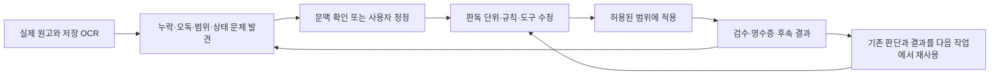

# 원고를 처리하며 바뀐 workflow

[English](../../history/evolution.md)

[History](README.md) · [전체 문제 분기·합류 지도](HISTORY.md#history-map)

VOKU의 실무 문제는 오래된 방송 원고를 보존하면서 공개용 이미지와 텍스트를 준비하는 일이었습니다. OCR은 검색과 이름 판독의 출발점이었지만, 정형 연락처와 달리 이름은 방송 역할·자기소개·작품 인용·동명이인·취소선·손글씨의 문맥을 요구했습니다. 초기 계획은 명단 구축→후보 수집→사람 판정→마스킹을 크게 나누었지만, 실제 작업은 이 도식대로 한 번에 끝나지 않았습니다. [E01](reference/evidence.md#e01)

아래 그림은 관측된 반복을 설명하기 위한 **이번 회고의 요약**입니다. 원래부터 존재했던 실행기나 고정 DAG가 아닙니다.

## 1. OCR을 더 하면 해결될까

초기 사람 검토에서 고친 이름 131건 중 61건은 이미 기존 두 OCR 중 하나에 있었습니다. OCR 재인식 이전에 후보 추출·분절·좌표·동일인 연결을 분리해야 했습니다. 제한된 재OCR는 일부 표기를 개선했지만, 알려진 513건의 재생 평가에서 기존 440건의 대상 회수 수를 늘리지 않았습니다. 신원 재구성의 전체 실행도 이미지 마스킹 완료와는 다른 결과였습니다. [사례 1](cases/01-ocr-and-identity.md)

대규모 신원 재구성 (P0-4.5v2)의 두 attempt, blind image pilot 준비, 직접 이미지 판독의 오독, 명단 통합 검증기의 false negative를 함께 남깁니다.

## 2. 작업자를 늘리는 것과 판단을 덜 반복하는 것은 달랐습니다

실제 이미지 서브에이전트를 사용한 운영과 중단 기록이 있습니다. 이후 사용자는 반복 판독·JSON 작성·인계 설명에 드는 시간을 줄이도록 요청했습니다. 주된 이름 처리에서는 같은 연도·학기·편성의 미제출 원고 전체가 의미 판단 단위가 되었고, 두 독립 실행 세션이 공용 DB와 신원 권위를 사용했습니다. Vision·렌더·내보내기 프로세스는 별도 기계 처리였습니다. 고정된 Planner/Worker/Reviewer 조직으로 모든 시기를 설명할 수 없습니다. [사례 2](cases/02-reading-and-state.md)

에이전트는 이름 발견과 분류 외에도 상태 조사, 원인 분석, 코드 수정, 회귀 검증, 질문 묶기, 정확한 중단 위치 작성, 보정본 통합을 담당했습니다. 사람도 설계만 한 것이 아니라 오독·누락·형태·적용 범위를 직접 고쳤습니다. 중요한 것은 각 판단이 **다음 결정문, 좌표, 질문, 영수증 또는 코드**로 소비되었다는 점입니다.

## 3. 보류의 원인에 따라 후속 작업이 갈라졌습니다

1차 제출이 끝나도 기하 실패와 의미 미확정이 남았습니다. 이미 출력된 이미지를 보는 앱과 보류된 원본을 보는 앱은 다른 모집단이었습니다. 작은 호칭 보정은 기존 신원을 재사용했고, 초기 연도 보류와 후기 보류는 서로 다른 조건으로 처리됐습니다. 후기의 한 패키지는 여러 기계 수정을 구현하고도 부분 적용에 머물렀고, 나중의 별도 패키지는 사용자가 판독 범위를 보류 페이지로 좁힌 뒤 2,230쪽의 독립 결과를 완성했습니다. [사례 3](cases/03-review-and-repair.md)

검토 앱의 bbox는 문제를 알려 주는 위치일 수 있고, `name` 입력란도 항상 확정 인명은 아니었습니다. 저장된 사람 의견을 자동 마스크로 바꾸지 않고, 새 판독·수정 결정의 입력으로 사용했습니다. 이미지가 바뀌면 과거 `ok`를 현재 승인으로 가져오지 않는 버전 관리도 필요했습니다.

## 4. 문제의 범위를 다시 정하자 도구도 달라졌습니다

결재란에서는 도장 바깥 잉크까지 추적하던 적용을 되돌린 뒤 정해진 칸 내부로 범위를 좁혔습니다. 이후 7번 칸 추가는 새로운 범위 변경이었습니다. 연락처에서는 OCR 줄 폭 비례 좌표가 넓게 가린 문제를 수정했고, 발견 원장과 실제 마스크가 다르자 이미지 차이로 물리적 영역을 복원했습니다. 사람의 위치 안내, 기하 탐색 범위, 최종 마스크는 서로 달랐습니다. [사례 4](cases/04-approval-and-contacts.md)

## 5. 여러 결과를 합칠 때는 지운 영역뿐 아니라 복원 영역도 필요했습니다

독립 결과들은 공통 원본에서 출발했지만 모두 같은 시점의 수정 이력을 담지는 않았습니다. 사용자는 하위의 다른 이름 마스크를 보존하면서 상위 수정 영역을 우선하도록 정했습니다. 이름 레이어를 먼저 합치고 결재란, 연락처를 순서대로 적용했습니다. 전체 최신 이미지를 선택하거나 단순 차이 픽셀만 합치면 의도한 복원이 사라질 수 있습니다. [사례 5](cases/05-composition.md)

## 6. 최종 합성 뒤에도 이력과 OCR을 다시 맞추었습니다

토큰 크기 수정에서 최신 영수증에 없는 과거 토큰 8개가 빠졌습니다. 사용자가 이유를 요구하자 과거 수정 이력과 백업을 재생하여 원인을 확인하고 지정된 8개만 고쳤습니다. 이후 최종 이미지에서 OCR을 새로 생성하고 선택된 이름·연락처 보정에 맞춰 해당 문서의 OCR만 갱신했습니다. 각 부분 갱신에서는 같은 문서 JSON 안의 비대상 페이지와 나머지 문서를 보존했습니다. [사례 6](cases/06-history-and-final-ocr.md)

## 무엇이 자동이었고 무엇이 판단이었나요

| 작업 | 판단이 필요했던 부분 | 코드가 소비한 결과 |
|---|---|---|
| 이름 판독 | 이름인지, staff/private/public인지, 같은 사람인지, 호칭 범위인지 | 원문 인용·분류·기존 ID 연결·미해결 사유 |
| 보정 | 누락·과잉·잘못된 토큰·방향·복원 여부 | 지정 페이지와 확정 영역·유지할 예외 |
| 실행 관리 | 새 근거가 있는지, 범위를 바꿀지, 어디까지 중단할지 | 공식 제출·소유권·상태·체크포인트 |
| 좌표·렌더 | 모호한 획·회전·경계의 선택적 확인 | 실측 좌표·지움/토큰 상자·레이어 순서 |
| 검증 | 자동 검증이 놓친 문제의 재정의 | 해시·허용영역 밖 픽셀·범위/집합·현재 버전 검사 |

이 표는 영구적인 사람/AI 역할 배정이 아닙니다. 실제로 같은 판단을 서로 다른 시점에 사람 또는 에이전트가 수행했습니다.
