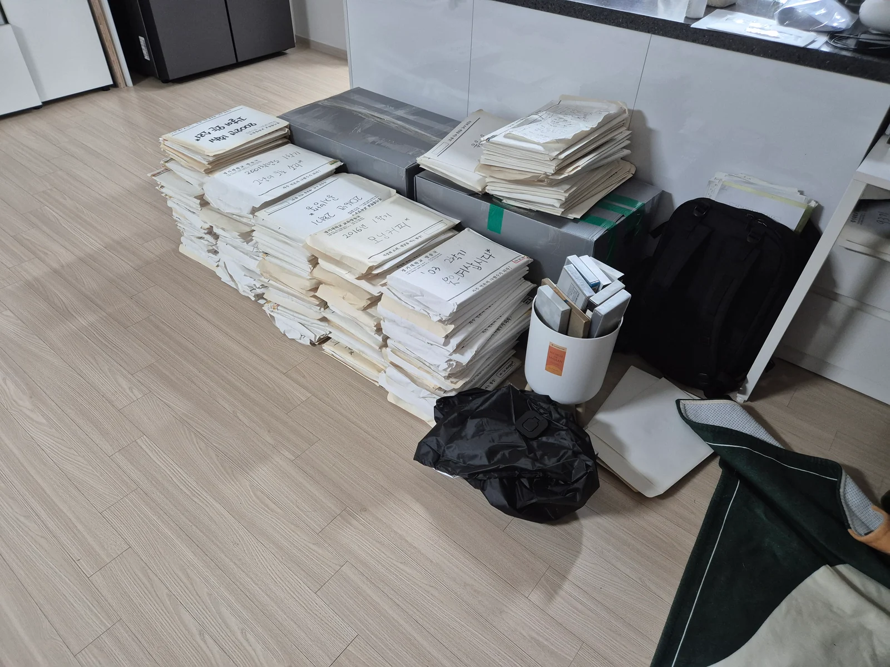
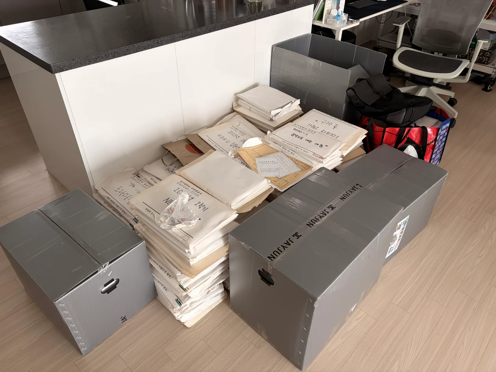
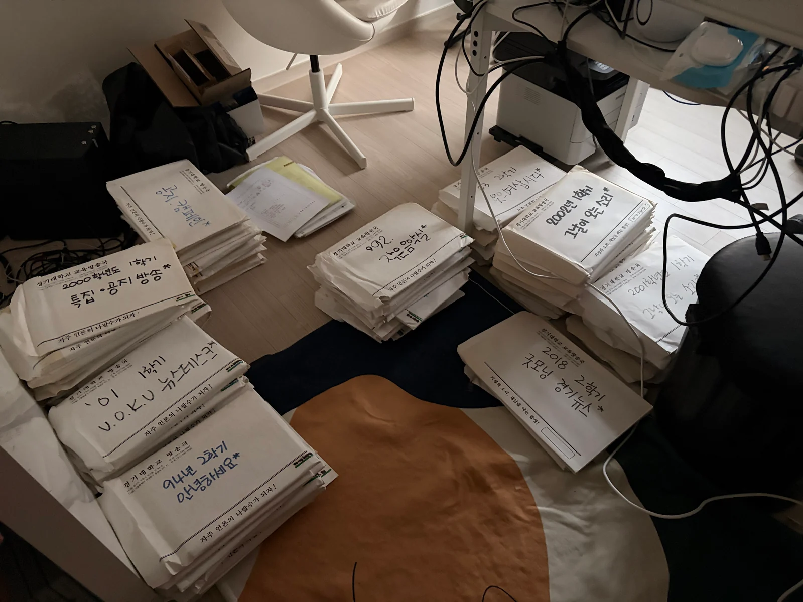
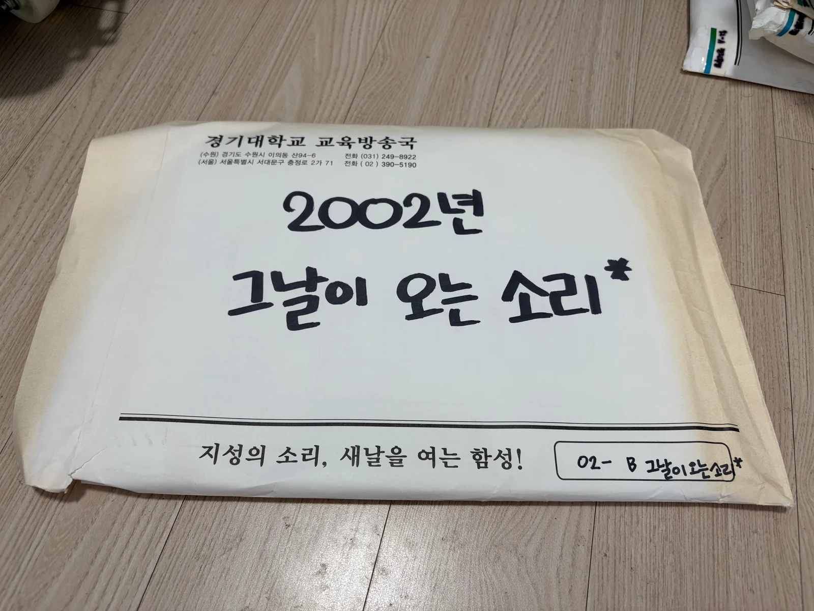
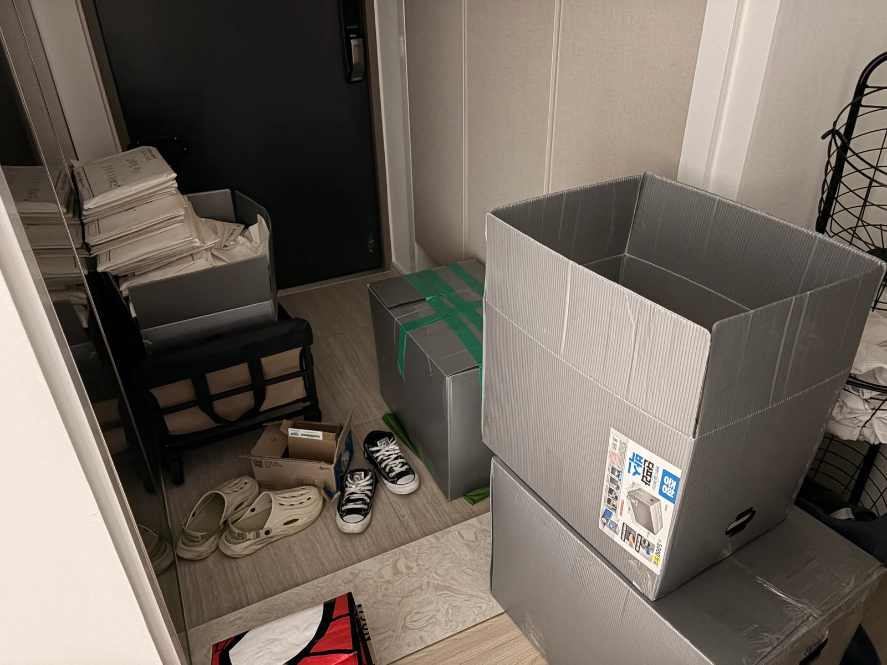

# 집에서의 보관

[English](../../../history/photos/storage.md)

[사진 목록](README.md) · [History](../README.md) · [프로젝트 소개](../../README.md)

가져온 자료를 거실과 방, 현관에 나눠 보관했습니다. 폴더 표지에는 연도와 프로그램명이 남아 있습니다.

|  |  |
|---|---|
| 거실에 줄지어 쌓아 둔 종이 폴더 | 거실의 큐시트 묶음과 보관 상자 |

|  |  |
|---|---|
| 방 안 작업 책상 아래 보관한 자료 | 연도와 프로그램명을 적은 종이 폴더 |

현관에 모아 둔 큐시트와 상자
