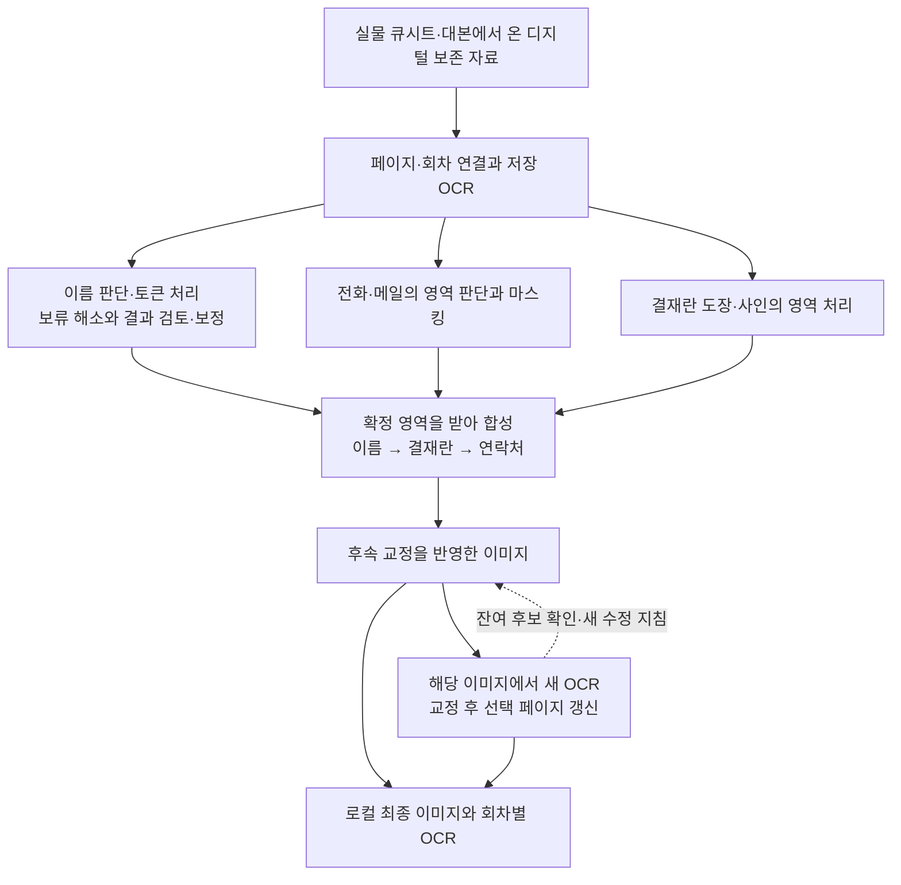

# VOKU Archive Workflow

[English](../../workflow/README.md)

[프로젝트 소개와 제작 경위](../README.md) · [당시 작업 방식의 변화](../history/evolution.md)

이 문서는 큐시트에서 보호할 부분을 판단하고, 주변 문장과 문서 구조를 남기며 이미지·OCR로 연결한 작업 방식을 설명합니다.

이 글이 설명하는 최종 디지털 처리 범위는 **1988–2019년 66,010쪽·5,330회차 문서**입니다. 연도를 특정하지 못한 `Unknown` 4,413쪽은 이 최종 합성에서 제외됐습니다. 페이지 이미지와 회차별 OCR의 로컬 생성 기록을 연결했습니다. [범위와 집계 근거](../history/reference/status-and-counts.md)

작업은 결과에서 드러난 문제를 다음 판단과 도구의 입력으로 바꾸며 진행됐습니다. 사람과 에이전트가 원고를 읽고, 누락·오독·과잉 가림을 지적하고, 필요한 범위나 구현을 바꾸었습니다. 다음 작업은 그때 확정한 인물 연결, 수정 영역, 적용 기록을 이어받았습니다. 같은 이름을 다시 읽는 것과 이미 판단한 이름의 좌표만 고치는 일을 나눌 수 있었던 이유입니다.

별도로 진행한 작업을 자료와 결과가 이어지는 축으로 묶은 그림입니다. 각 단계의 실행 도구, 사람·에이전트의 판단과 수동 검토 자료 전달이 함께 사용됐습니다.

- [인간–에이전트 운영 방식](human-agent-workflow.md): 실제 결과에서 무엇을 발견하고, 어떤 근거로 판단·규칙·도구를 바꿨는지 살펴봅니다.
- [자료에서 최종 이미지·OCR까지](pipeline.md): 입력과 판단, 보류·보정, 합성, 후속 OCR 갱신이 어떻게 연결됐는지 살펴봅니다. [마지막 연결의 확인 범위](pipeline.md#final-link)도 함께 설명합니다.
- [세 회차 실행 데모](demo.md): 가상화한 공개 입력에서 판독·처리·보정과 최종 OCR까지의 결과를 봅니다.
- [공개 검토 웹앱 안내](assets/human-review/README.md) · [앱 HTML](../../workflow/assets/human-review/index.html): 같은 데모 중 8면을 비교하고 상태·메모·문제 영역을 기록합니다. 자기 환경에서 실행하는 정적 샘플이며, 의견은 브라우저에만 저장됩니다.
- [History 기준본](../history/README.md): 사건의 순서와 당시 적용 범위, 상세 사례와 공개 근거를 따라갑니다.

이 공개본은 2026-09-26의 `history-anchor-v3`와 폴더별 분석을 바탕으로 편집하고, 2026-09-27 제작자 확인 내용을 연결했습니다. 실행 데모와 검토 웹앱에는 개인 식별정보를 가상화한 입력·결과와 조작 화면을 제공합니다. 저장소의 [공개 범위와 한계](../README.md#공개-범위와-남은-한계)는 루트 소개에 모았습니다.

[세 회차 실행 데모](demo.md)는 개인 식별정보를 가상화한 1994·2003·2017 큐시트로 판독, 영역 처리, 검토·보정, 합성과 최종 OCR의 실제 결과를 보여줍니다. [2017년 토큰 잘림 보정](demo.md#decisions-to-repair)에서는 인물 연결과 토큰을 유지하면서 실패한 처리 순서만 바꾼 과정을 따라갑니다. 재생 코드는 그 판단을 확정한 뒤의 연산을 검증하는 도구입니다.
