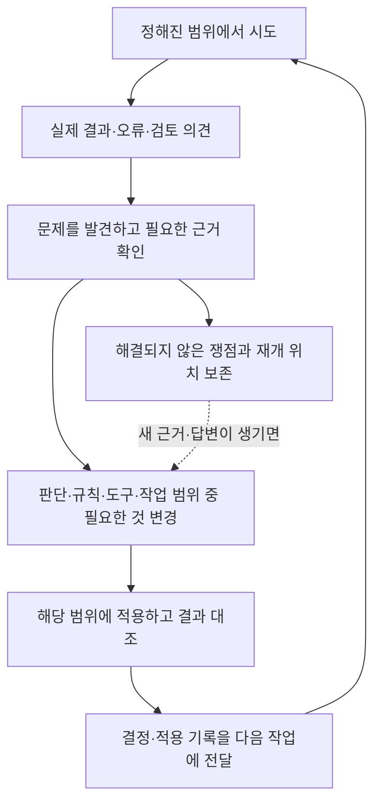

# 인간과 에이전트가 문제를 다음 작업으로 넘긴 방식

[English](../../workflow/human-agent-workflow.md)

[Workflow](README.md) · [데이터 흐름](pipeline.md)

이 프로젝트의 규칙은 실제 원고와 처리 결과를 보면서 구체화됐습니다. 사람은 이름을 직접 읽거나 잘못 가린 곳을 지적했고, 에이전트는 문맥을 판단하고 실패 원인을 조사하며 도구를 고쳤습니다. 사용자가 처리 방향을 정하면 에이전트가 이를 좌표 조건이나 실행 규칙으로 구체화한 경우도 있었습니다. 그렇게 만든 결과를 다시 보고 방향이나 구현을 수정했습니다. [운영 방식의 변화](../history/evolution.md)

Chat과 로컬 에이전트를 각각 기획과 실행에 고정할 수는 없습니다. 당시 접근할 수 있었던 원고·저장 OCR·상태·도구에 따라 할 수 있는 일이 달랐습니다. 대화에서 정한 범위가 로컬 처리의 조건이 되고, 로컬 출력에서 발견한 문제가 다시 판독·질문·설계의 입력이 됐습니다. 기록에 남은 요청, 판독, 코드 변경, 적용 결과를 연결해야 실제 역할이 드러납니다.

## 결과에서 출발해 필요한 부분을 바꾸기

아래는 여러 작업에서 관측되는 연결을 정리한 그림입니다. 모든 페이지에 같은 횟수의 검토나 같은 승인 절차를 적용한 것은 아닙니다.

코드와 판독은 이 흐름에서 다른 일을 했습니다. OCR 묶음을 만들고 인용문·페이지·해시를 검사하는 코드는 자료 전달과 제출 형식을 확인했습니다. 그 문장의 인물이 방송국 스태프인지, 일반 학생인지, 작품에 인용된 공적 인물인지는 별도의 판독이었습니다. 반대로 에이전트가 이름을 알아도 좌표나 토큰 배치가 실패하면 이미지 처리는 끝나지 않았습니다. [판독 단위와 기계 처리의 분리](../history/cases/02-reading-and-state.md)

별도로 실행한 공개 demo의 [토큰 잘림 사례](demo.md#decisions-to-repair)에서는 이 구분을 전후 이미지로 볼 수 있습니다. 이미 확정한 인물 연결과 토큰을 유지하고, 뒤의 지움이 앞선 토큰을 침범하는 처리 순서만 고쳤습니다. 아래의 과거 아카이브 사례들과 적용 범위가 다른 세 회차 작업입니다.

## 사례 1: 전체 이름의 판단을 짧은 호칭에 이어 쓰기

한 회차에는 이미 두 사람의 전체 이름과 기존 가명 토큰이 연결돼 있었습니다. 그런데 대화 중 성을 생략한 두 글자 이름에 호칭이 붙으면 기존 처리에서 빠졌습니다. 후속 보정은 28쪽의 저장 OCR에서 해당 호칭 10곳을 찾았습니다. 대상 9쪽 중 8쪽은 앞 단계에서 변경 없음으로 남았던 페이지였습니다. 기존 마스킹 출력만 살펴서는 이 누락을 다루기 어려웠습니다.

새로 필요한 판단은 회차 안의 짧은 호명이 이미 확정한 두 사람을 가리키는지였습니다. 그 연결을 기록한 뒤에는 기존 ID와 토큰을 유지하며 반복 위치를 처리했습니다. 저장 OCR의 호칭 오독은 탐색에서 허용하되, 이미지에서 이름 뒤의 호칭까지 지우지는 않았습니다.

첫 적용에서 한 곳은 이름의 떨어진 모음 획과 뒤 호칭의 경계를 나누지 못했습니다. 실측 잉크 폭과 글자 사이의 빈 공간을 이용하도록 보완한 뒤 10곳·9쪽의 독립 보정물을 만들었습니다. 이때 다시 푼 것은 기하 문제였고, 두 사람의 신원 판단과 후보 목록은 재사용했습니다. 최초 발견자가 누구였는지는 확인되지 않습니다. [사례와 적용 범위](../history/cases/03-review-and-repair.md), [당시 경계 처리 코드](../../history/historical/names/short_alias.py)

## 사례 2: “더 밀착해서 가리기”를 실행 가능한 규칙으로 만들기

연락처 처리 결과에서는 넓은 마스크가 주변 문맥을 가렸고, 겹친 상자 안에 불필요한 경계선이 남았습니다. 사용자는 마스크를 연락처에 더 밀착시키고 구분기호를 포함하며 겹친 내부 테두리를 없애도록 요청했습니다. 이를 구현하려면 먼저 실제 이미지의 어느 영역을 되돌릴지 알아야 했습니다.

에이전트가 원장과 이미지를 대조하자 과거 발견 좌표 108행이 실제 마스크와 맞지 않았습니다. 원본과 결과의 변경 픽셀을 이용해 물리적 마스크 영역을 복구하고, 그 안에서 새 지움 범위를 정하는 도구로 보완했습니다. 새 마스크는 겹친 사각형의 합집합을 채우고 바깥 윤곽만 그렸습니다. 큰 사각형 하나로 둘러싸는 것과는 지워지는 면적이 달랐습니다.

검토 중에는 숫자로 쓴 연락처뿐 아니라 한글로 풀어 쓴 번호와 이메일 발음 메모도 범위 문제가 됐습니다. 사용자의 답변은 포함할 대상을 구체화했고, 에이전트의 이미지 확인과 코드는 이를 별도 영역으로 옮겼습니다. 당시 기존 3,518쪽 재조정과 뒤의 신규 76쪽 적용은 서로 다른 작업이었습니다. 후자의 82개 발견 근거는 반복·분절 표기를 확인한 뒤 90개 물리 영역으로 적용됐습니다. **무엇을 찾았는지와 어디를 실제로 가렸는지 사이에 판단이 있었습니다.** [연락처 처리의 전환](../history/cases/04-approval-and-contacts.md), [적용 근거](../history/reference/evidence.md#e21)

## 사례 3: 완료 보고를 실제 결과와 과거 이력으로 다시 확인하기

합성 뒤 토큰 크기를 조정했지만 한 페이지의 토큰 8개는 그대로였습니다. 사용자가 이유부터 요구하자, 에이전트는 수정 전 백업과 현재 픽셀을 대조하고 최신 적용 기록(영수증)보다 앞선 수정 이력을 읽었습니다. 해당 토큰들은 이전 보정에서 들어왔고, 최신 영수증만 읽은 준비 로직의 작업 목록에는 없었습니다.

사용자는 그 8개만 두 글자씩 두 줄·13px로 바꾸도록 범위를 지정했습니다. 에이전트는 과거 글리프를 재현해 기존 토큰을 제거하고 새 배치를 적용했습니다. 다른 토큰과 주변 픽셀, 다른 페이지는 보존했습니다. 이 사례에서 사람은 결과를 반박하고 수정 범위를 정했으며, 에이전트는 누락 원인을 추적하고 제한된 교정을 수행했습니다. 이후 같은 페이지에 다른 수정이 더해졌으므로 이 영수증만을 현재 페이지 전체의 최종 상태로 보지는 않습니다. [과거 토큰 재생 사례](../history/cases/06-history-and-final-ocr.md), [후속 이력의 연결](../history/reference/evidence.md#e26)

## 이미 얻은 근거를 어디까지 재사용했습니까

반복을 줄이는 방식은 작업마다 달랐습니다. 주된 1차 이름 처리에서는 같은 연도·학기·프로그램의 여러 회차를 함께 읽어 인물 문맥을 유지했습니다. 반면 후기 보류 해소 경로(`new-boryu`)에서는 사용자가 빠른 1차 처리와 자신의 후속 육안 검토를 선택하면서, 읽을 범위를 보류 페이지의 저장 OCR로 좁혔습니다. 에이전트는 매 페이지 이미지 확인을 요구하던 기존 경로와 구분되는 연속 처리 경로를 만들었습니다. 앞서 본 전체 문맥을 매번 새로 읽은 것처럼 표시하지 않았습니다. [편성 단위 판독](../history/cases/02-reading-and-state.md), [후기 보류의 범위 변경](../history/cases/03-review-and-repair.md)

재사용할 때에는 문제의 종류를 구별했습니다. 이름의 물리적 위치가 그대로이고 신원 연결만 바뀌면 좌표를 다시 찾을 필요가 없는 경우가 있었습니다. 반대로 성이 빠진 이름을 전체 이름으로 넓히는 결정이라면 옛 좌표를 그대로 쓰면 안 됐습니다. 후기 보류 도구는 이 차이에 맞춰 공간 근거와 출력에 들어갈 신원·토큰을 따로 비교하도록 수정됐습니다. [캐시와 복원 문제](../history/reference/evidence.md#e17)

| 다음 작업에 남긴 것 | 이어서 할 수 있었던 일 |
|---|---|
| 실제 OCR 인용, 인물 연결과 적용 범위 | 같은 문맥의 반복 등장에 기존 ID·토큰을 쓰고 새 예외만 판단 |
| 검토한 이미지 버전, 위치와 의견 | 어느 결과에서 생긴 문제인지 확인하고 해당 보정으로 전달 |
| 수정 전 이미지, 지움·토큰·복원 영역과 영수증 | 다른 보정과 합치거나 이후 교정에서 과거 연산을 추적 |
| 미해결 이유와 실제 판독·제출 위치 | 읽었지만 제출하지 않은 부분, 판단했지만 적용하지 못한 부분에서 재개 |

검토 앱은 바뀐 이미지에 옛 의견을 그대로 붙이지 않도록 버전과 이미지 지문을 사용했습니다. 중단 기록도 읽기 완료, 공식 제출, 이미지 생성, 내보내기를 나눠 남겼습니다. 다음 작업이 재사용한 것은 이런 구체적인 결과였으며, 단순한 완료 문장 하나가 아니었습니다. [검토 이력과 전달](../history/cases/03-review-and-repair.md), [상태별 의미](../history/reference/status-and-counts.md)

## 판단을 맡는 것과 승인 권한은 달랐습니다

1차 이름 분류는 주어진 정책 안에서 에이전트가 수행했고, 초기 연락처 처리에는 코드가 후보를 찾아 자동 적용하는 경로도 있었습니다. 모든 항목에 별도의 사람 승인이 있었던 것은 아닙니다. 명단 정정, 일부 신규 토큰, 특정 복원·제외·정확한 사각형 적용은 해당 기록의 사용자 결정과 허용 범위에 따라 진행됐습니다.

검토 화면의 지침 작성 완료, 에이전트의 시각 확인, 기술 검증, 독립 교정 완료, 최종 폴더의 수신 반영은 각각 별도 기록입니다. 실제 결과를 최종 폴더에 반영했어도 원천 DB의 보류 상태나 사람 승인 상태를 바꾸지 않은 경로가 있었습니다. 이 구분을 유지해야 사람이 한 일을 에이전트의 자율 판단으로 바꾸거나, 기술적으로 처리된 결과에 없던 승인을 덧붙이지 않을 수 있습니다. [완료의 목적어](../history/reference/status-and-counts.md), [생산자와 수신자의 기록](../history/cases/05-composition.md)
