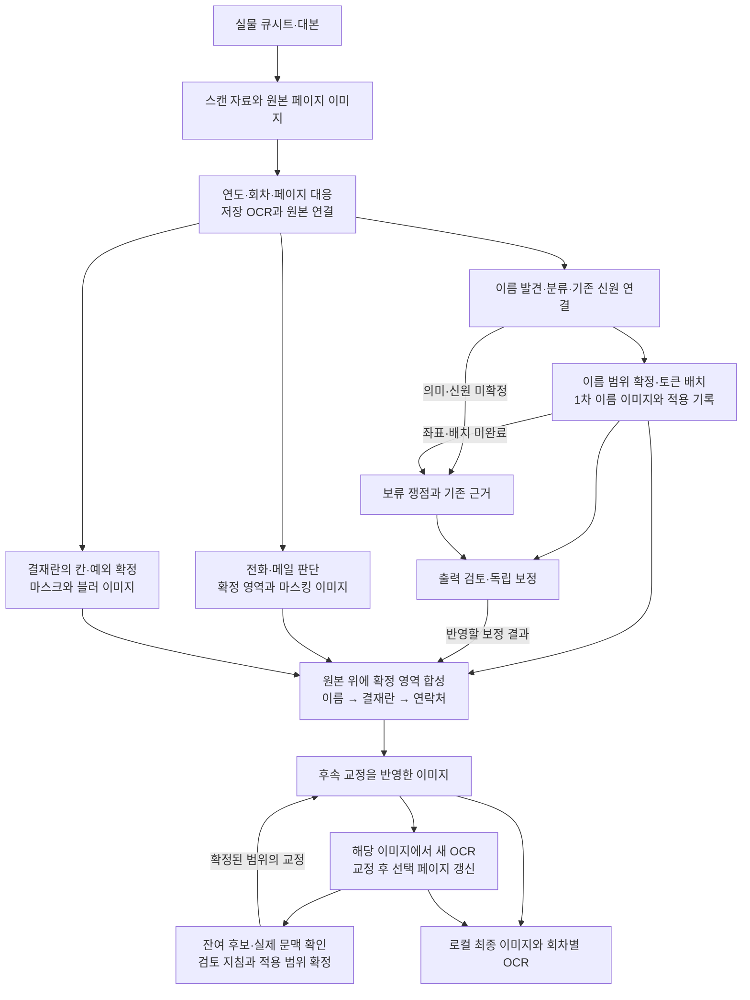

# 자료에서 최종 이미지와 OCR까지

[English](../../workflow/pipeline.md)

[Workflow](README.md) · [인간–에이전트 운영 방식](human-agent-workflow.md)

이 흐름의 중심은 **보존 자료 → 판단이 붙은 작업 자료 → 수정 영역과 독립 결과 → 합성·후속 교정 이미지 → 그 이미지에서 읽은 OCR**입니다. 실제 작업을 기능별로 묶은 설명이며, 처음부터 존재한 단일 실행 설계도가 아닙니다. 아래의 병렬 갈래는 별도 작업 경로를 뜻하며 반드시 동시에 실행됐다는 뜻은 아닙니다.

도식의 화살표에는 서로 다른 전달 방식이 들어 있습니다. 1차 이름 패키지 안에서는 공식 제출 뒤 좌표·렌더·내보내기 큐가 이어졌습니다. 검토와 독립 보정 사이에는 검토 DB·내보내기 파일·사용자 지시와 에이전트 판단이 개입했습니다. 합성 구간에는 실제 합성기가 있었고, 최종 OCR에는 별도 실행 도구가 있었습니다. 이들을 전부 호출하는 하나의 통합 실행기가 있었다고 설명하지 않습니다. [판독·큐](../history/cases/02-reading-and-state.md), [검토 전달](../history/cases/03-review-and-repair.md), [합성](../history/cases/05-composition.md)

## 1. 물리 문서를 페이지와 회차로 찾아갈 수 있게 만들기

출발 자료는 방송의 큐시트와 대본입니다. 인쇄된 문장 위의 필기, 교체된 담당자와 취소선, 표 안팎의 이름, 회전된 본문처럼 글자와 배치가 함께 의미를 가집니다. 작업용 이미지에서 이름만 바꾸더라도 그 옆의 역할명·호칭·표 선이 사라지면 원고를 읽는 방식이 달라질 수 있었습니다.

제작자가 2026-09-27 확인한 설명에 따르면, 집에서 혼자 복합기로 2026년 2월 17일부터 6월 6일까지 스캔했습니다. 스캔·1차 분류 뒤 번아웃으로 약 두 달 쉬었고, 8월 15일 작업을 재개해 9월 25일 이번 공개분의 마스킹·토큰 처리를 마무리했습니다. 이는 제작자 설명으로 보완한 경위이며, 당시 스캔 로그를 새로 확인한 결과는 아닙니다. [제작 경위](../README.md#왜-어떻게-만들었나요)

보존 코드·기록에서 직접 연결되는 디지털 출발점은 이미 만들어진 PDF·페이지별 WebP·회차별 OCR JSON입니다. 자료 취합 도구는 이것들을 연도별로 복사해 모았습니다. **PDF→WebP 변환기의 정확한 구현은 여전히 확인되지 않았습니다.** 후반 처리 기간을 스캔까지 포함한 전체 제작 기간으로 제시하지 않습니다. [입력 자료의 근거](../history/reference/evidence.md#e02)와 [당시 확인 한계](../history/reference/limits.md)는 과거 기록으로 유지합니다.

작업에서는 원본 페이지와 별도의 파생 결과를 연결했습니다. 회차 키와 페이지 번호·파일명은 OCR을 이미지로 찾아가는 데 쓰였고, 해시는 어떤 내용의 파일을 읽고 수정했는지 확인하는 데 쓰였습니다. 저장 OCR에는 본문·줄·대안·좌표가 남아 이후 이름 판독의 입력이 됐습니다. 원본을 읽거나 필요한 픽셀을 가져오는 일과 파생 이미지를 변경하는 일은 구별됐습니다.

**다음 단계로 넘어간 것**은 텍스트만이 아니라 대응 원본을 찾을 수 있는 OCR과 파일 연결이었습니다. OCR JSON 생성 성공은 이름을 모두 읽었다는 뜻이 아니었습니다. 초기 5,330문서의 품질 기록도 PASS 4,879, REVIEW 420, FAIL 31을 따로 남겼습니다. 빈 OCR이나 페이지 대응 문제는 이름 없음과 구분할 필요가 있었습니다. [집계 단위와 품질 상태](../history/reference/status-and-counts.md)

## 2. 이름 후보에서 실제 처리 결정과 이미지로

공개 [세 회차 demo](demo.md#decisions-to-repair)는 이어받은 신원 판단, 추가 판독, 이미지 적용 실패와 순서 보정을 실제 자산으로 연결합니다. 그 안의 `replay.py`는 확정 연산을 재생하며 판독 자체를 수행하지 않습니다. [취소 상태 표시 보정](demo.md#cancelled-token-repair)도 같은 구분을 유지합니다.

주된 이름 판독·마스킹 경로(`voku-read-only-masking`)는 저장 OCR을 이용한 1차 처리였습니다. 에이전트는 당시 정한 판독 범위의 OCR과 대안을 읽고 제작진 표, 자기소개, 인터뷰, 끝인사 등을 연결했습니다. 발견한 이름을 기존 명단과 대조했으며, 명단에 있는 문자열만 검색하는 것으로 판독을 대신하지 않았습니다. 이름이 보이는가, 어느 분류인가, 누구와 연결되는가를 나눠 기록했습니다. [1차 판독 운영](../history/cases/02-reading-and-state.md)

| 이름에 대한 판단 | 이미지에서의 기본 처리 | 이어받을 근거 |
|---|---|---|
| 방송국 스태프 | 이름을 지우고 고정된 네 글자 가명 토큰 기입 | 방송 업무 문맥, 확정 ID와 기존 토큰 |
| 일반인 | 이름 영역을 흰색으로 가림; 해당 시기의 외곽선 규칙 적용 | 인명·일반인 문맥과 이름 범위; 개인 ID·토큰은 만들지 않음 |
| 공개 인물·명확한 작품 저자 등 보존 대상 | 원문 유지 | 해당 등장 문맥과 보존 이유 |
| 분류나 스태프 연결 미확정 | 쟁점을 남겨 후속 판단으로 전달 | 경쟁 후보, 부족한 사실, 이미 처리한 부분 |

가명 토큰은 같은 사람의 등장을 후속 처리에서도 이어 쓰는 표식이었습니다. 전체 이름과 성을 뺀 호칭을 같은 인물로 연결한 근거가 있으면 기존 ID·토큰을 재사용했습니다. 모든 비슷한 표기를 전역에서 합친 것은 아니며, 문서 한정 등록과 별도 사용자 예외도 있었습니다. 가상배역·한 글자 화자 등은 시점과 지시에 따라 처리 범위가 달라졌으므로 위 표를 모든 후속 작업의 고정 규칙으로 소급하지 않습니다. [짧은 호칭과 후속 보정](../history/cases/03-review-and-repair.md)

판단 뒤에도 **좌표 확정과 이미지 변경**이 남았습니다. OCR 줄 상자는 위치를 찾는 출발점이었습니다. 이름만 들어 있는 기존 좌표, 필요한 국소 인식과 실제 잉크·빈 공간, 선택적 원본 확인으로 지울 범위를 정했습니다. 이름을 지우는 상자와 토큰을 놓는 상자를 분리해, 토큰을 크게 넣기 위해 주변 원문까지 지우지 않도록 했습니다. 이름을 알지만 범위를 못 찾거나 토큰 공간이 부족한 경우에는 부분 처리·보류를 남겼습니다. [기하 처리의 실패와 보완](../history/cases/02-reading-and-state.md)

다음 작업이 받은 출력은 이름 이미지와 함께 분류·ID·토큰, 지움·배치 영역, 실패 사유와 적용 기록이었습니다. 이 적용 기록을 작업에서는 **영수증**이라고 불렀습니다. 1차 제출은 5,330문서 전체에 존재하지만, 내보낸 이름 이미지는 21,009쪽이었습니다. 변경 없음 40,714쪽, 부분 처리 4,182쪽, 보류 105쪽도 따로 남았습니다. 이 상태들을 합쳐 마스킹 완료로 부를 수는 없습니다. [1차 결과의 분모](../history/reference/status-and-counts.md)

## 3. 연락처와 결재란은 별도 판단·처리로 준비하기

이름 전용 작업이 전화·메일·주소·학번까지 한꺼번에 가린 것은 아닙니다. 연락처와 결재란은 별도 입력과 규칙으로 처리했고, 뒤의 합성에서 이름 결과와 만났습니다.

| 갈래 | 입력과 핵심 판단·처리 | 출력과 합성에 쓰인 조건 |
|---|---|---|
| 전화번호·이메일 | 저장 OCR의 문자열과 연락 문맥에서 후보를 찾고 원본의 실제 영역으로 좁힘. 한글 발음·분절·연필 메모는 해당 후속 지시로 포함 | 수정 이미지와 현재 마스크 좌표. 과거 발견 원장을 현재 지움 좌표로 간주하지 않고, 숫자 연도 결과 3,563쪽을 최종 합성에 사용 |
| 결재란 도장·사인 | 원본의 수평·수직선과 칸 배열을 확인. 일반 최종 범위는 7칸 중 3·5·7번 내부이며, 위치 안내와 명시적 사각형 예외를 구별 | 실제 적용 픽셀을 정한 마스크와 블러 이미지 12,194쪽. 확정된 칸·예외의 범위만 합성에 전달 |

연락처 초기 처리에는 정규식 후보의 자동 적용이 있었고, 후속 조사에는 문맥·이미지 검토와 사용자 승인에 따른 제한 적용이 있었습니다. 결재란에서는 도장의 글자를 모두 판독해 신원을 정하는 대신 처리할 칸을 확정했습니다. 사용자가 그린 사각형도 대개 칸을 찾을 탐색 범위였으며, 전체를 블러하라는 명시적 예외에서만 최종 마스크가 됐습니다. [두 갈래의 판단과 범위 변화](../history/cases/04-approval-and-contacts.md)

결재란 처리의 보류 집계가 0이어도 후속 라벨 탐색에서 경계를 확정하지 못한 4쪽은 별도로 남았습니다. 합성은 이 빈틈을 새 좌표로 채우지 않았습니다. 또한 위의 연락처·결재란·이름 페이지 집합은 서로 겹칩니다. 수를 더해 전체 수정 페이지 수로 쓰지 않습니다. [합성의 잔여 경계](../history/cases/05-composition.md)

## 4. 보류와 검토 의견을 해당 교정 경로로 돌려보내기

검토의 입력은 두 종류였습니다. 완료본 검토에서는 이름 마스크·토큰·주변 문자의 상태를 봤고, 보류 검토에서는 마스킹 전 원본과 앞선 실패 사유를 봤습니다. 같은 “이상 없음”이라도 어떤 이미지에 붙은 의견인지가 달랐습니다. 검토 앱은 페이지·이미지 버전·문제 위치·메모를 저장했고, 앱 자체가 마스킹을 다시 실행하지는 않았습니다. [검토 입력의 차이](../history/cases/03-review-and-repair.md)

[공개 검토 웹앱](assets/human-review/README.md)은 기존 검토 화면과 BBOX·이름 입력, 상태·메모 저장, 변경 이력·JSONL 내보내기를 재사용합니다. [실행 데모](demo.md)의 전체 49쪽 / 53면 중 1994·2003·2017년 8면에서 가상화한 입력과 최종 결과를 전환해 볼 수 있습니다. 공개 부속물은 자기 환경에서 실행하는 정적 샘플입니다. 새 의견의 브라우저 저장과 사용법은 [웹앱 안내](assets/human-review/README.md)에 있습니다.

후속 보정은 그 의견에 기존 OCR, 신원 연결, 좌표와 영수증을 보탰습니다. 오래된 마스크가 옆 글자를 덮었다면 필요한 부분을 원본에서 복원한 뒤 새 마스크를 그렸습니다. 검토 사각형은 문제를 가리키는 안내일 수도 있고, 사용자가 그대로 적용하도록 지정한 최종 영역일 수도 있었습니다. 어느 쪽인지는 해당 지시와 보정 결정에 따라 달랐습니다.

| 돌아온 문제 | 후속 처리와 결과가 돌아간 곳 |
|---|---|
| 1차 처리의 신원·분류·좌표 보류 | 이미 얻은 판단을 보존하면서 부족한 근거 또는 기하만 보완. 독립 이름 이미지와 영수증을 만들어 합성 입력으로 전달 |
| 완료 이미지의 누락·과잉 가림·토큰 문제 | 검토한 버전과 지정 범위를 기준으로 독립 교정. 정상 부분을 유지하고 수정·복원 영역을 함께 전달 |
| 교정본을 다시 본 검토 의견 | 해당 교정 경로의 새 개정으로 반영. 바뀐 이미지와 옛 검토 상태를 구별 |
| 합성 이미지·재OCR에서 찾은 잔여 후보 | 별도 검토 지침으로 좁힌 뒤 실제 적용된 결과만 최종 이미지에 반영; OCR 갱신 여부는 별도 확인 |

초기 연도 보류 2,057쪽과 후기 보류 2,230쪽은 별도 결과를 만들었습니다. 후기에는 먼저 만든 패키지가 부분 실행에 머물렀고, 같은 대상 전체를 별도 보류 해소 경로(`new-boryu`)가 완료했습니다. 합성은 첫 패키지의 실제 수정본과 다른 경로의 결과를 함께 받을 수 있었지만, 존재하지 않는 완료본을 가정하지 않았습니다. [보류 처리의 분기](../history/cases/03-review-and-repair.md)

후기 이름 보정 경로(`supplement-2000-2019`)는 완료본의 재검토 대상과 뒤의 구체적 지침을 받았습니다. 별도 검토 앱에서 내보낸 세 차례의 문제 항목이 보정 입력 사본으로 연결되고, 수정된 이미지가 다시 검토 대상이 된 기록도 있습니다. 새 질문이 생기면 다른 처리는 계속하면서 그 쟁점을 남겼습니다. 독립 교정 완료는 원천 DB의 보류 해제나 사람의 최종 승인을 자동으로 바꾸지 않았습니다. [검토와 보정의 왕복 근거](../history/reference/evidence.md#e19)

## 5. 파일 전체보다 각 작업의 수정 영역을 합성하기

최종 합성·OCR 작업 공간(`final-tri-force`)은 공통 원본에 이름, 결재란, 연락처 결과를 합쳤습니다. 상위 보정 이미지가 하위의 모든 마스크를 포함한다는 보장은 없었습니다. 그래서 **하위의 다른 수정은 유지하고 상위가 책임진 지움·토큰·복원 영역만 교체**했습니다.

| 이름 레이어의 범위 | 합성 우선순위: 낮음 → 높음 |
|---|---|
| 1988–1999 | 1차 이름 → 짧은 호칭 보정 → 초기 완료본 교정 → 초기 보류 교정 |
| 2000–2019 | 1차 이름 → 후기 별도 보류 해소 → 후기 문맥 보류의 실제 수정본 → 후기 이름 보정 |
| 이름 합성 다음 | 결재란 → 연락처 |

이 순서는 결과를 합치는 우선순위입니다. 각 작업의 개발·실행 순서가 아닙니다. 입력이 다른 기존 이미지를 참조하기만 하는 행은 새 수정 레이어로 세지 않았습니다. 이름 결과에 남아 있던 과거 연락처 마스크도 파일 전체를 복사해 승계하지 않고, 해당 이름 작업의 허용 영역을 사용했습니다. [실제 합성 관계와 코드](../history/cases/05-composition.md)

복원 기록이 필요한 이유는 원본과의 차이만으로는 수정 의도를 알 수 없기 때문입니다. 한 이름을 원본으로 복원하면 그 픽셀은 원본과 같아져 차이 이미지에서 사라집니다. 하지만 아래 레이어의 잘못된 마스크를 없애야 한다는 결정은 여전히 전달돼야 합니다. 그래서 적용 영수증에는 지움과 토큰뿐 아니라 복원 영역과 이전 대상 영역도 필요했습니다.

합성기는 입력 해시와 크기, 기대한 합성 픽셀, 허용 영역 밖 보존, 무손실 WebP를 저장한 뒤 다시 읽은 결과를 검사했습니다. 여기서 검증한 것은 확정된 작업이 제대로 전달됐는가였습니다. 무엇을 보호해야 하는지 새로 판독하거나, 미해결 상태를 자동 해소하는 단계는 아니었습니다.

최초 결과는 숫자 연도 66,010쪽이며 아무 레이어도 없던 37,768쪽은 원본을 복사했습니다. 이후 지정된 후속 보정이 들어올 때에는 해당 결과와 수신 영수증을 남겼습니다. 레이어 없음은 개인정보 없음이나 공개 승인이라는 판정이 아니며, 최초 합성의 수량은 후속 수정 이후의 고유 수정 페이지 수와도 구별합니다. [합성 집계와 검증 범위](../history/reference/evidence.md#e22)

## 6. 합성 이후의 교정과 OCR을 같은 이미지 버전에 연결하기

최종 잔여 오류 검토·교정 공간(`final-boriu-zebal`)은 합성 이미지에서 생성한 OCR을 다시 탐색했습니다. 후보 문맥을 읽고, 필요한 이미지를 확인하며, 검토 화면에 지침을 남겼습니다. 검토 지침과 독립 수정본은 `final-tri-force`의 후속 반영 기록으로 연결됩니다. 생산자 기록에 당시 미병합이 남아 있어도 나중의 수신 기록으로 실제 반영이 확인되는 경우가 있습니다. [생산자와 수신자의 연결](../history/cases/05-composition.md)

첫 전체 OCR은 2026-09-23의 이미지 66,010쪽을 5,330회차 JSON으로 만들었습니다. 그 뒤 이름 교정과 토큰의 크기·방향·배치 수정이 이어졌습니다. 최신 영수증 밖의 과거 토큰까지 재생한 이유도 현재 이미지에 여러 수정 이력이 쌓여 있었기 때문입니다. 첫 OCR이 있다는 사실만으로 이 후속 이미지의 텍스트까지 갱신됐다고 볼 수는 없습니다. [수정 이력과 재OCR](../history/cases/06-history-and-final-ocr.md)

후속 지침과 지정 영역 교정은 수신 기록을 통해 이미지에 반영됐습니다. 이후 두 번째 전체 OCR이 그 시점의 이미지를 다시 읽었고, 그 뒤 이름·연락처 교정은 실제 바뀐 페이지만 새로 읽어 회차 JSON에 반영했습니다. 같은 회차의 비대상 페이지와 기존 갱신 이력은 보존했습니다. 옛 OCR 문자열에서 이름만 지워 새 결과처럼 만든 방식이 아닙니다. [후속 통합 기록](../history/reference/evidence.md#e23) · [전체·선택 OCR의 범위와 집계](../history/reference/evidence.md#e24) · [지정 영역 적용과 보존 예외](../history/reference/evidence.md#e25)

| OCR의 위치 | 사용한 이미지·역할 |
|---|---|
| 앞 단계의 저장 OCR | 원본의 이름·문맥을 읽고 페이지를 찾는 판단 보조 자료. 오독과 대안도 당시 근거로 보존 |
| 합성 이미지에서 생성한 OCR | 그 시점에 보이는 이미지의 텍스트. 잔여 후보를 찾는 후속 입력으로도 사용 |
| 교정 뒤 선택 갱신 OCR | 실제 바뀐 페이지 이미지를 다시 읽어 회차 문서에 반영. 비대상 페이지와 기존 갱신 이력은 유지 |

최종 OCR의 생성·저장 검증과 일부 현재 이미지·OCR 해시 대조는 확인됩니다. 다만 과거 최상위 합성 목록에 후속 이미지의 해시가 반영되지 않은 표본이 있어, 그 목록 하나로 공개할 이미지 버전을 확정할 수는 없습니다. 해당 페이지의 후속 적용 영수증과 OCR의 입력 이미지 해시를 함께 읽어야 합니다. [최종 집계](../history/reference/status-and-counts.md) · [목록과 현재 파일의 차이](../history/reference/evidence.md#e26)

**확인 범위는 실제 반영·갱신 기록과 제한된 표본까지입니다.** 현재 66,010개 이미지와 모든 OCR의 해시를 전수 재대조하지 않았으며, 모든 후속 교정본의 일치나 OCR 글자의 정확성, 모든 이름·연락처의 부재를 생성·저장 검증만으로 보장하지 않습니다.

## 7. 로컬 산출물과 공개 배포의 경계

확인되는 도달점은 합성·후속 교정된 로컬 페이지 이미지, 그 이미지에서 생성하고 선택 갱신한 회차별 OCR, 변경의 근거와 적용 이력입니다. 결재란 경계 미확정이나 지정 bbox 밖 보존처럼 처리 범위에 남긴 예외도 함께 존재합니다.

실제 아카이브의 공개 파일을 최종 선택해 패키징하고 외부에 배포한 완료 기록은 이 근거에서 확인되지 않습니다. History에 있는 공개 문서·선별 코드의 목록 및 패키지 검증은 설명 자료에 관한 기록입니다. 이를 실자료 이미지·OCR의 배포 완료로 바꾸지 않습니다. [공개 설명 자료의 검증 범위](../history/reference/verification.md)
