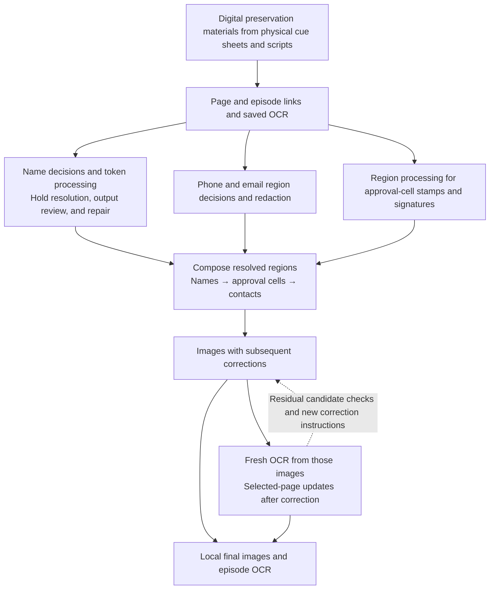

# VOKU Archive Workflow

[한국어](../korean/workflow/README.md)

[Project introduction and how it was made](../README.md) · [Changes in the working method](../history/evolution.md)

This document explains how the work identified parts of broadcast cue sheets that needed protection and connected them to images and OCR while preserving surrounding sentences and document structure.

The final digital processing scope described here is **66,010 pages in 5,330 episode documents from 1988–2019**. The 4,413 pages whose years could not be determined, grouped under `Unknown`, were excluded from this final composition. The account connects local generation records for page images and episode OCR. [Scope and counting evidence](../history/reference/status-and-counts.md)

The work progressed by turning problems visible in the outputs into inputs for the next judgment or tool. The human and agents read scripts, identified omissions, misreadings, and excessive redaction, and changed the necessary scope or implementation. Subsequent work inherited the identity links, correction regions, and application records resolved at that point. This made it possible to distinguish reading a name again from fixing only the coordinates of a name already assessed.

The diagram groups separately conducted tasks by the connections between their materials and outputs. It combines execution tools, human and agent judgments, and manual handoffs of review materials.

- [Human–agent working method](human-agent-workflow.md): what was found in actual outputs, and what evidence led to changes in judgments, rules, or tools.
- [From materials to final images and OCR](pipeline.md): how inputs and decisions, holds and repairs, composition, and later OCR updates connected. It also explains [the verification scope of the final connection](pipeline.md#final-link).
- [Three-episode execution demo](demo.md): reading, processing, correction, and final OCR using public inputs with synthetic personal identifiers.
- [Public review web app guide](assets/human-review/README.md) · [App HTML](assets/human-review/index.html): compare 8 panels from the same demo and record statuses, notes, and issue regions. It is a static sample to run in your own environment; feedback is stored only in the browser.
- [History baseline](../history/README.md): follow the sequence of events, their contemporary scope, detailed cases, and public evidence.

This public account was edited from the 2026-09-26 `history-anchor-v3` and per-folder analyses, and connected to the creator's confirmations on 2026-09-27. The execution demo and review web app provide inputs and outputs with synthetic personal identifiers and an example interface. The repository's [public scope and limits](../README.md#public-scope-and-remaining-limits) are collected in the root introduction.

The [three-episode execution demo](demo.md) shows actual results from reading, region processing, review and repair, composition, and final OCR of 1994, 2003, and 2017 cue sheets with synthetic personal identifiers. The [2017 clipped-token repair](demo.md#decisions-to-repair) follows a change to the failed processing order while keeping identity links and tokens. The replay code verifies operations after those judgments have been resolved.
