# VOKU · From reading decisions to public images

[한국어](../korean/workflow/demo.md)

[Workflow](README.md) · [Human–agent working method](human-agent-workflow.md) · [Processing stages and evidence](pipeline.md)

[Public review web app guide](assets/human-review/README.md) · [App HTML](assets/human-review/index.html): compare **8 of the full demo's 49 physical pages / 53 logical panels** and leave feedback. This is a static sample to download and [run locally](assets/human-review/README.md#run-locally); new feedback stays only in the browser. Records of the historical archive work are in [History](../history/README.md).

Three episodes covering culture, news, and everyday life were actually processed through **safe inputs → reading and classification → region processing → review and repair → composition → fresh OCR**. The scripts below are **demo-source-safe** inputs in which protected personal names, phone numbers, personal stamps, and signatures were replaced with synthetic identifiers. The body text, public figures, departments, entry years, and relationships between manuscript revisions were retained. No entire page was redrawn through image generation.

*Protected personal identifiers are synthetic. The Korean scripts, public figures and document structure are retained.*

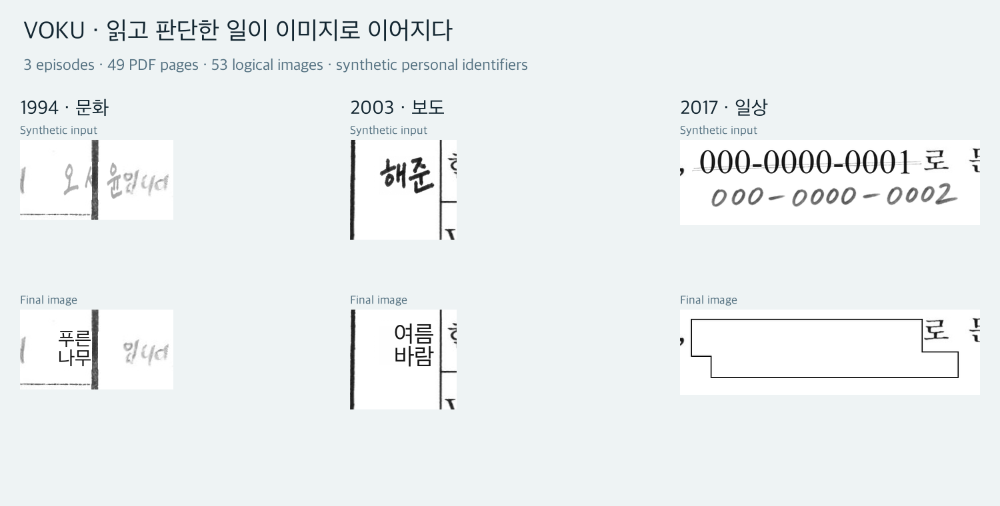

The Korean heading reads “VOKU · From reading decisions to images.” The columns are culture (1994), news (2003), and everyday life (2017); each pairs a synthetic input above with its final image below. Original figure labels and manuscript text are retained as part of the saved demo evidence.

| Episode | Document context | Actual processing | Representative judgment |
|---|---|---:|---|
| 1994 영화음악실 | Culture | 19 PDF pages | Boundary between small handwriting and a form rule |
| 2003 VOKU 뉴스데스크 | News | 17 PDF pages | Distinguishing full names, speaker aliases, and people in news stories |
| 2017 투유 연애조작단 | Everyday life | 13 PDF pages | Cancelled names and numbers and handwritten replacements |

A total of **49 physical pages** were processed. The two rotated panels on each of the 2017 episode's pages 2–5 were unfolded and read separately, making **53 logical panels** the working and OCR units. Representative scenes are shown here; [the complete files](#complete-episodes-and-execution-records) include every input and output.

<a id="decisions-to-repair"></a>

## Repairing execution while retaining existing decisions

Some evidence was provided at the outset. The user guide supplied links between 1994 production credits and self-introduction names, links between 2003 full names and speaker aliases, and designated private individuals and people to preserve. This demo checked those against actual occurrences in the safe inputs. The agent additionally identified two private individuals in 2003, while follow-up user answers supplemented the 2017 handwriting reading and specified preservation of departments and entry years. [Sources and retained decisions](assets/demo/decisions.json)

Correct judgment could still lead to failed image application. Below are **the before-and-after outputs saved when repairing the 2017 name-processing order**. The upper tokens, `작은우주` and `맑은수풀`, correspond to handwritten additions; the lower tokens, `봄날햇살` and `산들구름`, correspond to cancelled printed names. Their distinct identities and tokens had already been resolved.

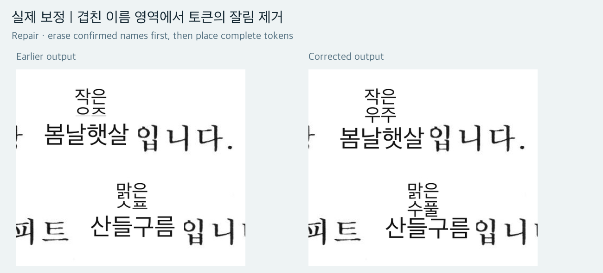

1. **The problem was found in the output.** The existing work record says the agent's review identified clipping among the upper and lower name tokens. On the left, the bottoms of the upper tokens are cut off.
2. **Judgment was separated from execution failure.** Erasing one name, placing its token, and then erasing the next name allowed a later erasure region to intrude on an earlier token. The overlap can also be checked in the current operations' `erase_sequence`, `erase_box`, and `token_box`. This comparison uses current coordinates to check the cause; it does not reconstruct unsaved historical execution logs.
3. **Identity links and tokens were retained.** No new names were created and no two people were merged. The issue did not require revisiting resolved classifications or tokens.
4. **Only the application order changed.** All resolved name regions were erased first, followed by token placement in a separate pass. The current `replay.py` function `render_layers()` also separates erasure and placement into two passes.
5. **The comparison was connected to the final implementation.** The bottoms of the tokens remain visible on the right. This order was applied in final image generation and is also used by subsequent replay. [Resolved operations for the panel](assets/demo/2017/complete/operations.json) · [Replay code](assets/demo/replay.py) · [Repair evidence links](assets/demo/decisions.json)

This comparison was retained unchanged as a record of the order repair at that time. The current outputs below also include a separate fix for **missing cancellation indicators** found during this review. Historical hold and repair work on the full archive belongs to [History](../history/cases/03-review-and-repair.md); the work rerun here was this three-episode demo. This section connects saved images, decisions, and code, rather than presenting a complete conversation transcript or chronological log.

`replay.py` applies these resolved operations to the safe inputs and verifies the outputs. Deciding which forms referred to the same person and producing review feedback took place outside the replay code. Deterministic replay makes it possible to recheck whether the retained judgments and changed execution method actually appear in the output.

## 1994 · Separating a small name from the sentence

The synthetic name `오서윤` in the production credits on page 8 and the small self-introduction name on the second line of the body refer to the same host. The user-provided connection was retained, and the actual strokes and form rule were checked again in the safe input. Both became `푸른나무`; for the smaller occurrence, the token was split into two syllables per line and placed to the left of the rule.

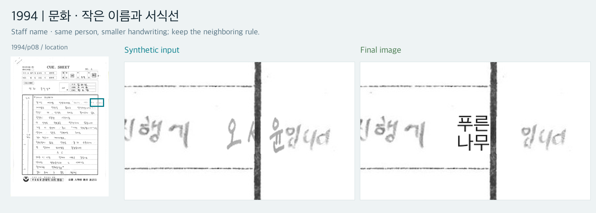

**Station-member name:** The same person keeps the same token even at different name sizes. The following `입니다` and vertical form rule remain. See [the same token in the credits](assets/demo/1994/staff.webp) and [erasure and placement regions](assets/demo/1994/tiny-name-regions.webp). In the region diagram, teal marks erasure and orange marks token placement. These are explanatory overlays, separate from the processed image.

## 2003 · The same speaker, different classifications

The page 5 credit pairs `이해준 ↔ 해준` and `김소린 ↔ 소린` each refer to the same announcer. These links were carried over from the user guide. Seven shortened-name occurrences on page 7 were read and connected to the same tokens.

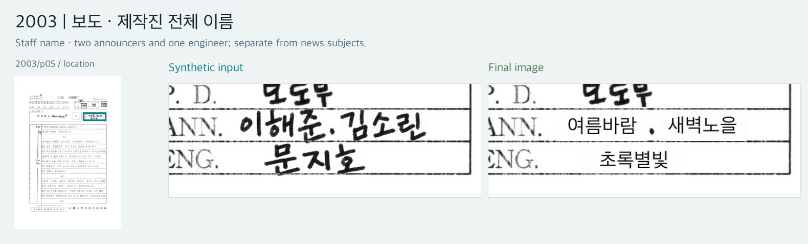

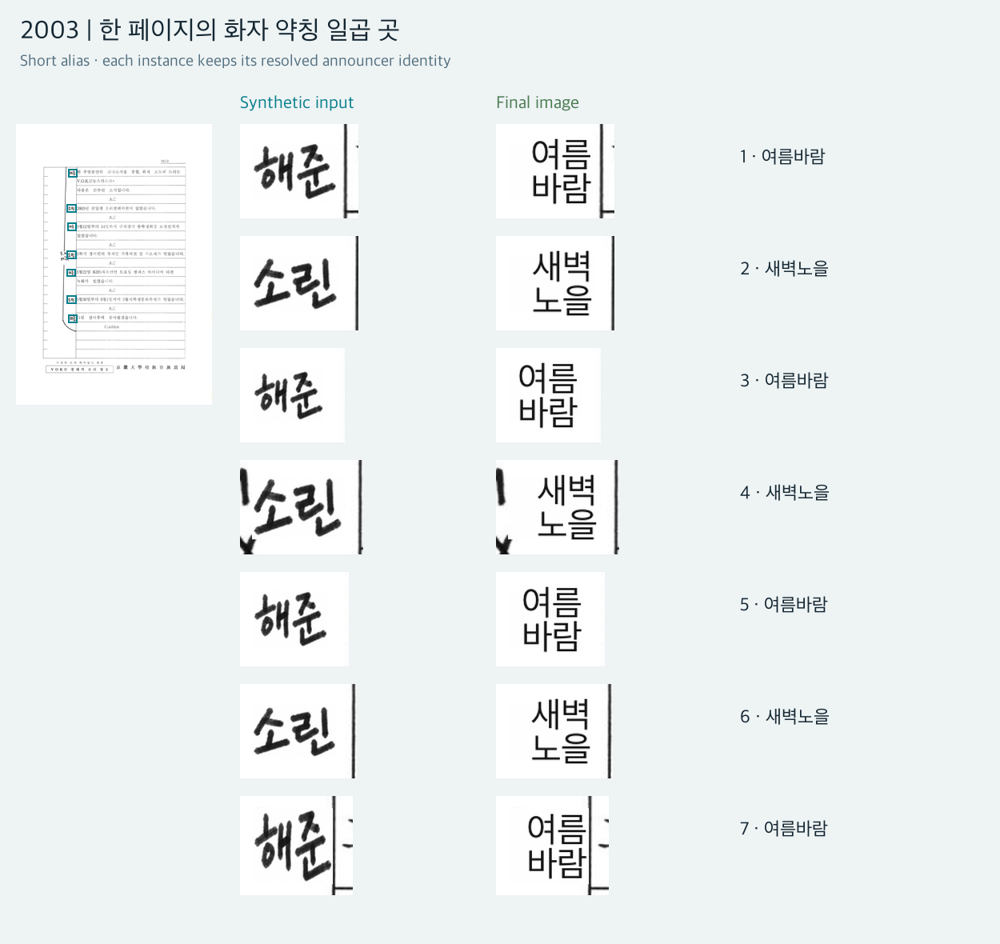

**Short alias:** `해준 → 여름바람`, `소린 → 새벽노을`. Credits use one line; speaker labels use a 2+2 layout. Connections made from a supplied guide were not counted as achievements of independent automatic detection.

What was reused here was the **identity link** between a full name and its shortened form. What was confirmed in the current input was the seven actual locations of those shortened forms. The links are in the [decision record](assets/demo/decisions.json); each erasure region and repeated use of the same token are on page 7 of the [2003 operation record](assets/demo/2003/complete/operations.json).

People in news stories received different decisions. Four candidates designated by the user and two additional private individuals identified during this reading were given synthetic names in the input, then covered in white with thin black borders in the final output. They were not given station-member tokens.

The decision record's [`ordinary_people`](assets/demo/decisions.json) distinguishes the four designated people from the two additional readings. Together, these six private individuals appear 11 times in operations marked `class: private`. Replaying existing designations is not described as the same thing as adding decisions from this reading.

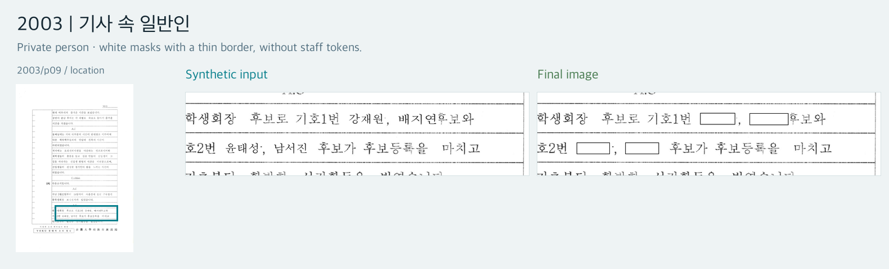

**Private individual / Keep:** `권영길 의원` on page 15 remains unchanged because the user designated it for preservation. [Before and after at the same location](assets/demo/2003/keep.webp). Merely appearing in a news story did not assign every person to the same class. [Reading and state](../history/cases/02-reading-and-state.md)

## 2017 · Reading a revised script as revised

Page 6 shows printed host names crossed out with different names written above. `고나린` and handwritten `김도현`, and `배서우` and handwritten `한예솔`, are respectively **different people**. The one-character speaker labels `고` and `배` remaining in the body were also recorded as references to the original people. They were not all merged into one person based on the revised hosting role.

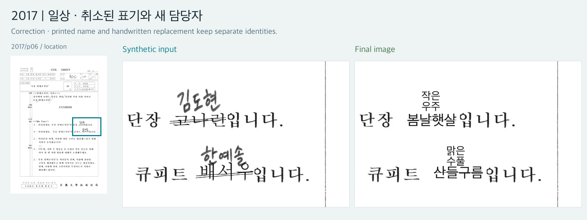

**Correction:** Different tokens remain for the upper and lower names. Connecting `replacement_examples` in the [identity distinction record](assets/demo/decisions.json) to the [2017 operations](assets/demo/2017/complete/operations.json) explains why cancelled printed names and new handwriting received different tokens. Cancellation reflects a revision in the input script, not a review mark added by this demo. [Erasure and token regions](assets/demo/2017/replacement-names-regions.webp)

<a id="cancelled-token-repair"></a>

This review found that the replay code did not draw cancellation marks even when `input_cancelled: true` was present. **Identities, tokens, one-line/2+2 layouts, and safe inputs were retained**, and a thin 1px straight line was newly drawn inside each row of cancelled tokens. Original name strokes were not restored. The lines were added after token placement to both the name layer and its mask so they would survive composition. At one location, only the line's start was moved inward to avoid an adjacent token. The final output in the comparison above and 20 locations across 7 panels from 2017 were updated. [Line coordinates, changed scope, replay, and OCR verification](assets/demo/revision-verification.json) · [Implementation: `cancellation_lines()`](assets/demo/replay.py)

Both the cancelled old number and the new number remain visible in the page 7 input. The safe input used distinct dummy values, `000-0000-0001` and `000-0000-0002`; the protection stage redacted both occurrences.

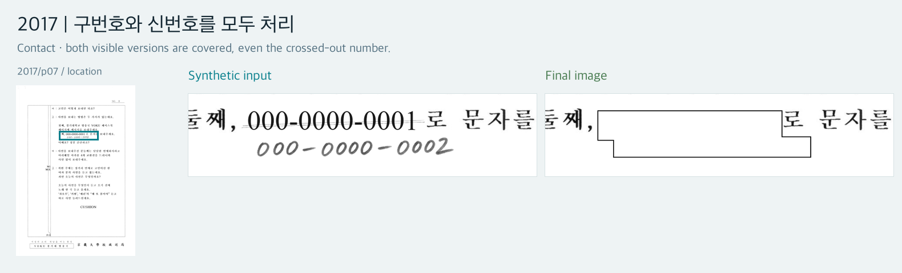

**Contact:** Deciding which number is currently usable differs from redacting the number regions still visible in the image. A partial revision on page 12 was processed by connecting the shared prefix and the handwritten replacement suffix. [Before and after the partial number revision](assets/demo/2017/contact-suffix.webp). The preserved [contact-union operation](../history/historical/contacts/paint_union.py), which leaves no interior borders in overlapping masks, was actually used.

Name and margin revisions on page 13 were also processed. Handwriting readings supplemented by the user were applied with their answers linked to the locations. **The follow-up instruction that departments and entry years were outside the redaction scope was applied**, excluding the academic-information region below from redaction.

This instruction did not discard the name-reading results. Name erasures and token operations were retained while non-name academic information was excluded. The `keep_examples` in the [preservation decisions](assets/demo/decisions.json) and [page 13 operations](assets/demo/2017/complete/operations.json) show this boundary. The cancellation-line repair did not enlarge those erasure regions.

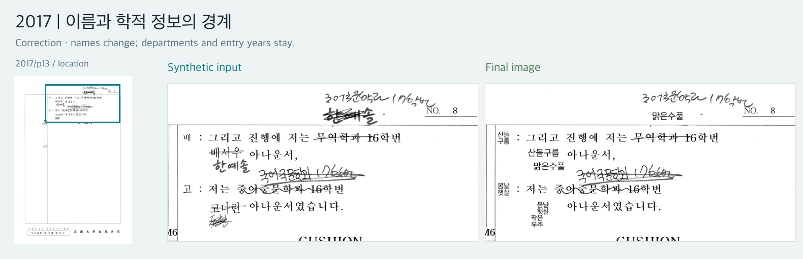

### Retained token-placement rules

The user-specified `TOKEN_SIZE_RULES_20260925.md` was also applied. Vertical speaker labels default to 2+2 at 17px; body text defaults to one line at 22px, switching to 2+2 at 14–17px in narrow spaces. Production credits used a consistent size within each episode, with the permitted 16px used in the low, dense credit cells of 2003 and 2017. Sizes were scaled proportionally from the reference height of 1,684px to each current logical-panel height. **Token glyphs were not horizontally compressed.** For 1994, outside the original rule's year range, the same vertical-role criterion was applied as a demo extension. [Actual size and layout record](assets/demo/execution-summary.json)

### Combining independent outputs by region

Names, approval cells, and contacts were **generated independently from the same safe input**. Approval processing covered the interiors of cells 3, 5, and 7 out of the 7 identified cells. Role labels and cell boundaries remained, and no tokens were inserted inside approval cells. The safe input preserved the non-name approval term `전결` and the date, but final approval processing blurred the selected cell interiors together. [Approval cells before and after](assets/demo/2017/approval.webp)

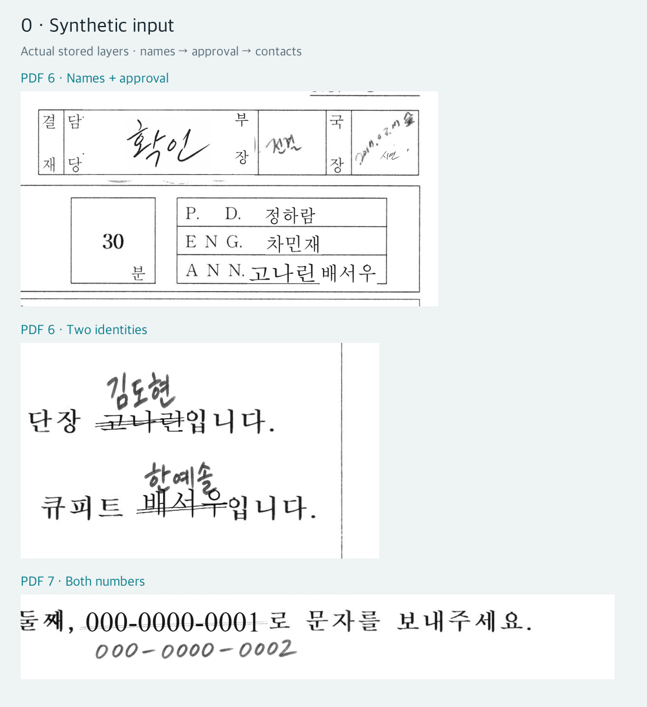

The GIF replays **names → approval cells → contacts** using actual saved outputs and application masks. The upper two scenes are from PDF page 6; the contact scene below is from PDF page 7. [Input still](assets/demo/2017/composition-frame-0.webp) · [Final still](assets/demo/2017/composition-frame-3.webp). Each layer supplied only the regions it was responsible for, rather than overwriting other work with an entire page. [Why composition uses regions](pipeline.md#composition)

## Text read again from final images

Apple Vision actually reread the final WebP images. Names were not merely replaced in old OCR, and the raw result below was not cleaned up for presentation.

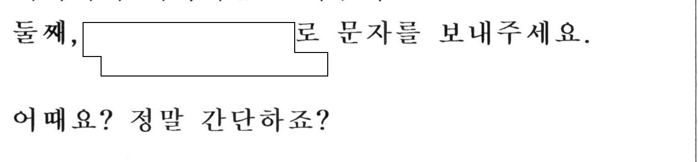

```text
둘째,
문자를 보내주세요.
어때요? 정말 간단하죠?
```

OCR omitted the `로` still visible in the image. That limitation remains in the raw result. [Raw OCR, coordinates, and input hash for the same crop](assets/demo/2017/final-ocr-excerpt.json) · [Complete final OCR](assets/demo/2017/final-ocr.json). For all 53 panels, the OCR `sourceSHA256` matches the actual final WebP. [Connecting final images and OCR](pipeline.md#final-link)

## Complete episodes and execution records

The 114 complete-episode WebP images were compressed at **quality 90**, making them **65.5%** smaller than the preceding lossless WebP versions while preserving resolution. The 44 comparison figures in the text are lossless WebP. The same resolved operations were rerun from the compressed safe inputs, and OCR was freshly read from the final WebP images. [Conversion verification](assets/demo/format-conversion.json)

Each ordinary episode folder contains **all safe inputs and final WebP images, raw input/final OCR, a page map, resolved operations, and file hashes**. The 2017 two-panel pages also include safe/final images reassembled in their original physical orientation alongside the logical panels. Original PDFs and hidden original text objects are excluded.

| Episode | Complete inputs and outputs | Raw OCR |
|---|---|---|
| 1994 · 19 physical pages / 19 panels | [Complete file index](assets/demo/1994/complete/README.md) | [Safe input](assets/demo/1994/safe-ocr.json) · [Final](assets/demo/1994/final-ocr.json) |
| 2003 · 17 physical pages / 17 panels | [Complete file index](assets/demo/2003/complete/README.md) | [Safe input](assets/demo/2003/safe-ocr.json) · [Final](assets/demo/2003/final-ocr.json) |
| 2017 · 13 physical pages / 17 panels | [Complete file index](assets/demo/2017/complete/README.md) | [Safe input](assets/demo/2017/safe-ocr.json) · [Final](assets/demo/2017/final-ocr.json) |

[Execution and verification summary](assets/demo/execution-summary.json) · [Public decision record](assets/demo/decisions.json) · [Replay code using only safe inputs](assets/demo/replay.py) · [Replay guide](assets/demo/README.md)

The protection stage actually applied processing to **196 station-member name occurrences**, **11 private-individual name occurrences**, **6 contact regions**, and **21 approval cells**. Person counts and occurrence counts are not conflated. During preparation, 18 personal stamp/signature regions were made synthetic, a different unit from the final approval-cell count.

Contacts used the preserved original code; composition used the original code's rectangle operations and separate pixel comparisons; OCR ran the preserved Swift implementation. Pillow rendering for approval cells, safe-input connections, and resolved token placement are adapters made for this demo. They are not described as a pre-existing integrated runner. [Scope of preserved code](../history/historical/README.md)

Original PDFs, History, and existing workflow explanations were kept read-only. Region processing in preparation and composition changed **0** pixels outside authorized regions. This check was before lossy distribution encoding; quality-90 compression affects pixels across the entire panel. The public replay code reproduced final WebP hashes for all 53 panels. This verifies file reproducibility and image–OCR connections. [Public scope and limits](../README.md#public-scope-and-remaining-limits) concerning reading accuracy, approval, and distribution are collected in the root introduction.

## Preparing inputs suitable for publication

This section records **demo-source-safe preparation**, before the reading and protection work described above. Existing synthetic names and contacts and before/after images were retained; the cancellation repair did not change the safe inputs.

During input preparation, the user pointed out that the handwriting patches did not resemble the script. Enlarged crops of actual handwriting were passed as references to the requested GPT-6 Luna / max subagent, which generated small ink patches for composition only in the required regions. The tool used was ImageGen; its internal model name is not asserted to be Luna. Original crops and real-name mappings were not published.

Following further feedback on cancellation strokes and digit size, copying cancellation strips that might contain original character strokes was removed, and new cancellation patches were placed over synthetic characters. The code that stretched digits to fit position boxes was also removed. Below are the same crop from two actually preserved safe-input versions. This is **a proportion repair for synthetic numbers in the input**, separate from the clipped-token and final cancellation-indicator repairs above.

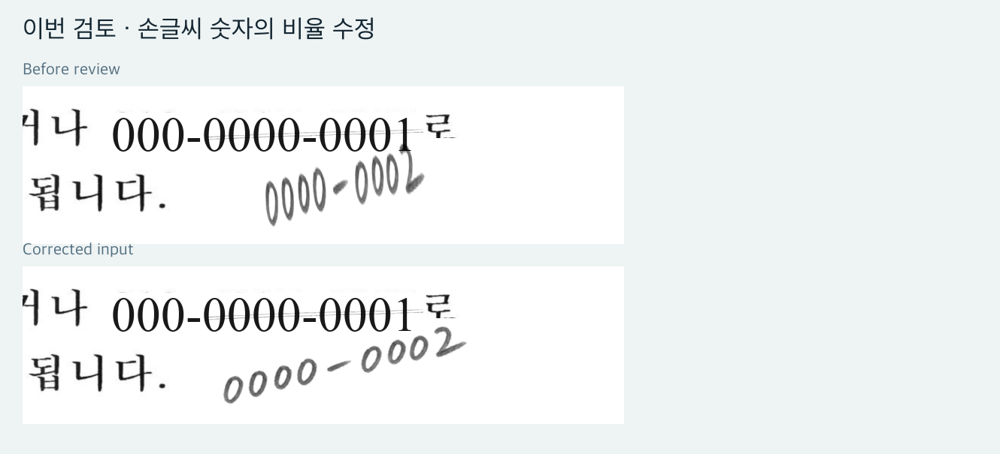
