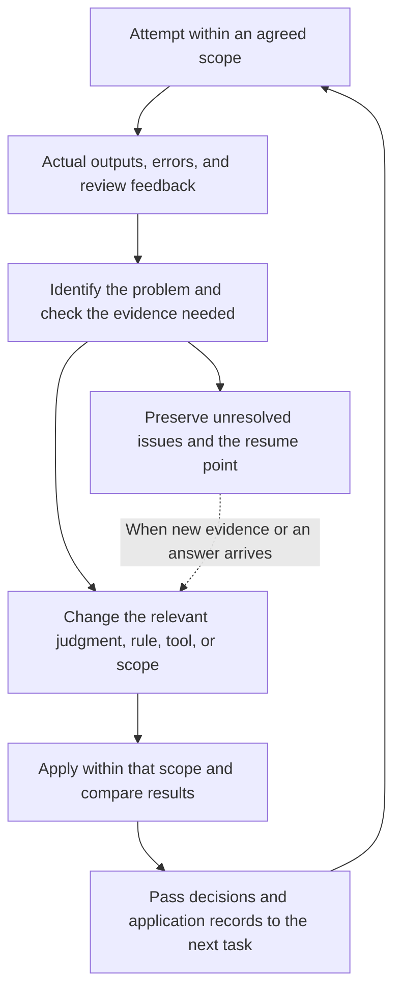

# How the human and agents carried problems into the next task

[한국어](../korean/workflow/human-agent-workflow.md)

[Workflow](README.md) · [Data flow](pipeline.md)

This project's rules took shape through examination of real scripts and processing outputs. The human read names directly or pointed out incorrect redactions; agents interpreted context, investigated failures, and repaired tools. In some cases, the user set the direction and an agent translated it into coordinate conditions or execution rules. The resulting output then prompted further changes in direction or implementation. [Changes in the working method](../history/evolution.md)

Chat and local agents cannot be assigned fixed roles of planning and execution, respectively. What they could do depended on the scripts, saved OCR, state, and tools available at the time. Scope agreed in conversation became conditions for local processing, while problems in local outputs became new inputs for reading, questions, and design. Their actual roles emerge by connecting the recorded requests, readings, code changes, and applied results.

## Starting from the output and changing what was needed

The diagram below summarizes connections observed across several tasks. The same number of reviews or approval procedure was not applied to every page.

Code and reading served different purposes in this flow. Code that assembled OCR packets and checked quotations, pages, and hashes verified material handoffs and submission formats. Deciding whether a person in a sentence was a station member, an ordinary student, or a public figure quoted in a work required a separate reading. Conversely, recognizing a name did not complete image processing if its coordinates or token placement failed. [Separating reading units from mechanical processing](../history/cases/02-reading-and-state.md)

The separately executed public demo's [clipped-token case](demo.md#decisions-to-repair) shows this distinction in before-and-after images. It retained resolved identity links and tokens and changed only the order in which later erasures intruded on earlier tokens. This three-episode task had a different scope from the historical archive cases below.

## Case 1: Carrying a full-name decision into shortened forms of address

Within one episode, two people's full names had already been linked to existing pseudonym tokens. But the earlier processing missed two-syllable given names followed by forms of address when the surname was omitted in dialogue. Follow-up work found 10 such occurrences in saved OCR for 28 pages. Of the 9 affected pages, 8 had been marked unchanged in the previous stage. Examining only existing redaction outputs would have made this omission difficult to address.

The new judgment was whether the shortened names within the episode referred to those two already resolved people. Once that connection was recorded, repeated occurrences were processed using the existing IDs and tokens. OCR misreadings of the following form of address were allowed during discovery, but that text was not erased from the image.

In the first application, one location failed to separate a detached vowel stroke in the name from the following form of address. The tool was adjusted to use measured ink widths and gaps between characters, producing an independent correction covering 10 occurrences on 9 pages. The problem solved again was geometric; the two identity decisions and candidate list were reused. Who first discovered the omission remains unconfirmed. [Case and application scope](../history/cases/03-review-and-repair.md), [contemporary boundary-handling code](../history/historical/names/short_alias.py)

## Case 2: Turning “redact more tightly” into executable rules

In contact-information outputs, broad masks obscured surrounding context, and overlapping boxes left unnecessary interior border lines. The user requested tighter masks around contacts, inclusion of separators, and removal of internal borders in overlaps. Implementing this first required finding the regions to restore in the actual images.

When the agent compared the ledger and images, 108 historical discovery rows did not match the actual masks. The tool was extended to recover physical mask regions from pixels changed between the original and output, then define new erasure regions within them. New masks filled the union of overlapping rectangles and drew only the outer contour. This erased a different area from one large enclosing rectangle.

During review, scope also became an issue for numbers spelled out in Hangul and notes recording an email address phonetically, alongside contacts written as digits. The user's answers specified what to include; image inspection and code converted those decisions into separate regions. Readjusting the existing 3,518 pages and applying newly found regions to another 76 pages were separate tasks. In the latter, 82 discovery records became 90 physical regions after repeated and fragmented forms were checked. **Judgment stood between what was found and where redaction was actually applied.** [The change in contact processing](../history/cases/04-approval-and-contacts.md), [application evidence](../history/reference/evidence.md#e21)

## Case 3: Checking a completion report against pixels and earlier history

Token sizes had been adjusted after composition, but 8 tokens on one page remained unchanged. When the user asked for the cause first, the agent compared pre-edit backups with current pixels and read revision history preceding the latest application record, or receipt. Those tokens came from an earlier repair and were absent from the work list generated by preparation logic that read only the latest receipt.

The user limited the correction to those 8 tokens: two syllables on each of two lines, at 13px. The agent reproduced the historical glyphs to remove the old tokens and applied the new layout. Other tokens, surrounding pixels, and other pages were preserved. Here the human challenged the output and set the correction scope; the agent traced the omission and performed a bounded repair. Later changes were made to the same page, so this receipt alone is not treated as the final state of the entire current page. [Historical-token replay case](../history/cases/06-history-and-final-ocr.md), [connections through later history](../history/reference/evidence.md#e26)

## How far existing evidence was reused

Ways of reducing repetition differed by task. In the main first-pass name processing, multiple episodes from the same year, semester, and program were read together to retain person context. In the later hold-resolution path (`new-boryu`), however, the user chose a fast first pass followed by their own visual review, narrowing the reading scope to saved OCR for held pages. The agent built a continuous processing path distinct from the existing path that required image inspection of every page. It did not mark all earlier context as freshly reread each time. [Program-unit reading](../history/cases/02-reading-and-state.md), [scope change for later holds](../history/cases/03-review-and-repair.md)

Reuse depended on the type of problem. If a name's physical position stayed the same and only its identity link changed, locating its coordinates again could be unnecessary. Conversely, a decision to expand a surname-omitted name to the full name made the old coordinates unsuitable. The later hold tool was changed to compare spatial evidence separately from the identity and token used in the output. [Cache and restoration issues](../history/reference/evidence.md#e17)

| What was left for the next task | What it enabled |
|---|---|
| Actual OCR quotations, identity links, and application scope | Reuse of existing IDs and tokens for repeated occurrences in the same context, with only new exceptions assessed |
| Reviewed image version, location, and feedback | Identification of the output in which a problem appeared and handoff to the relevant repair |
| Pre-edit images, erasure/token/restoration regions, and receipts | Combination with other corrections or tracing of earlier operations during later repairs |
| Unresolved reasons and actual reading/submission positions | Resuming where reading had not been submitted or a decision had not yet been applied |

The review app used versions and image fingerprints to avoid attaching old feedback unchanged to a changed image. Stop records also distinguished completed reading, formal submission, image generation, and export. Subsequent tasks reused these specific results, not merely a completion sentence. [Review history and handoffs](../history/cases/03-review-and-repair.md), [meaning of each state](../history/reference/status-and-counts.md)

## Making judgments and holding approval authority were different

Agents performed first-pass name classification within the given policy, and early contact processing also included a path where code found candidates and applied redactions automatically. There was not a separate human approval for every item. Roster corrections, some new tokens, and particular restorations, exclusions, and exact-rectangle applications followed the user decisions and authorized scope recorded for those tasks.

Completion of instructions in a review interface, agent visual inspection, technical verification, completion of an independent correction, and receipt into the final folder are separate records. Some paths applied actual outputs to the final folder without changing hold or human-approval states in the source database. Keeping these distinctions prevents human decisions from being recast as autonomous agent judgment or technical completion from acquiring an approval that never existed. [What “complete” refers to](../history/reference/status-and-counts.md), [producer and receiver records](../history/cases/05-composition.md)
