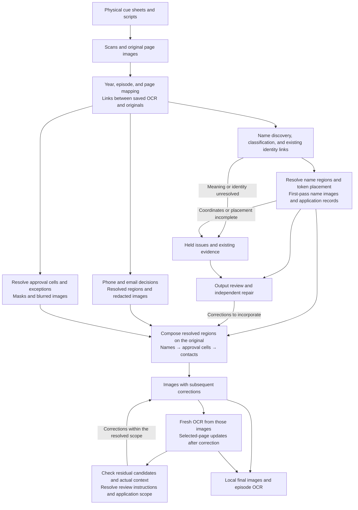
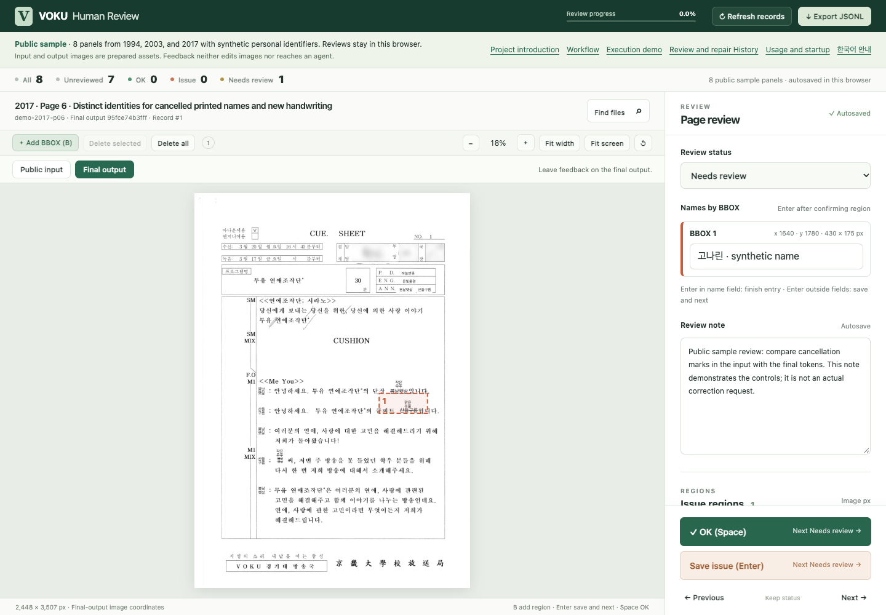

# From materials to final images and OCR

[한국어](../korean/workflow/pipeline.md)

[Workflow](README.md) · [Human–agent working method](human-agent-workflow.md)

The central flow is **preservation materials → working materials with decisions → correction regions and independent outputs → composed and subsequently corrected images → OCR read from those images**. This groups actual work by function; it was not a single execution design that existed from the outset. Parallel branches below denote separate work paths, not necessarily simultaneous execution.

The arrows represent different kinds of handoff. Within the first-pass name package, formal submission led to coordinate, rendering, and export queues. Between review and independent repair, review databases, exports, user instructions, and agent judgments intervened. Composition had an actual compositor, and final OCR had a separate runner. This account does not imply that one integrated runner invoked all of them. [Reading and queues](../history/cases/02-reading-and-state.md), [review handoffs](../history/cases/03-review-and-repair.md), [composition](../history/cases/05-composition.md)

## 1. Making physical documents accessible by page and episode

The starting materials were broadcast cue sheets and scripts. Handwriting over printed sentences, replacement assignments and cancellation strokes, names inside and outside tables, and rotated text carried meaning through both words and layout. Even when changing only a name in a working image, erasing the adjacent role label, form of address, or table rule could change how the script was read.

According to the creator's account confirmed on 2026-09-27, scanning was done alone at home with a multifunction printer from February 17 to June 6, 2026. After scanning and initial sorting, the creator took about two months off because of burnout, resumed on August 15, and completed this round of redaction and token processing on September 25. These circumstances supplement the record through the creator's account; they are not the result of newly checking contemporary scan logs. [How the project was made](../README.md#why-and-how-i-made-it)

The digital starting point directly supported by preserved code and records consists of already existing PDFs, per-page WebP images, and episode OCR JSON. Collection tools copied and gathered these by year. **The exact PDF-to-WebP converter implementation remains unconfirmed.** The later processing period is not presented as the entire production period including scanning. [Input-material evidence](../history/reference/evidence.md#e02) and [the limits of what was confirmed then](../history/reference/limits.md) remain historical records.

The work linked original pages to separate derivative outputs. Episode keys, page numbers, and filenames connected OCR to images; hashes identified the file contents read and modified. Saved OCR retained text, lines, alternatives, and coordinates as inputs for later name reading. Reading originals or taking necessary pixels from them was distinct from changing derivative images.

**What passed to the next stage** was not just text, but OCR and file links that could locate the corresponding original. Successful OCR JSON generation did not mean that all names had been read. The initial quality record for 5,330 documents separately recorded PASS 4,879, REVIEW 420, and FAIL 31. Empty OCR and page-mapping problems needed to be distinguished from an absence of names. [Counting units and quality states](../history/reference/status-and-counts.md)

## 2. From name candidates to processing decisions and images

The public [three-episode demo](demo.md#decisions-to-repair) connects inherited identity decisions, additional reading, failed image application, and processing-order repair through actual assets. Its `replay.py` replays resolved operations; it does not perform the reading itself. The [cancelled-token display repair](demo.md#cancelled-token-repair) keeps the same distinction.

The main name-reading and redaction path (`voku-read-only-masking`) was a first pass using saved OCR. Agents read OCR and alternatives within the assigned reading scope, connecting production credits, self-introductions, interviews, and closing remarks. Discovered names were checked against existing rosters; searching only for strings already in the roster did not replace reading. Whether a name appeared, how it was classified, and whom it linked to were recorded separately. [First-pass reading operations](../history/cases/02-reading-and-state.md)

| Name decision | Default image treatment | Evidence carried forward |
|---|---|---|
| Station member (`staff`) | Erase the name and insert a fixed four-syllable Hangul pseudonym token | Broadcasting-work context, resolved ID, and existing token |
| Private individual (`private`) | Cover the name region in white, with the outline rule used at that time | Person-name and private-individual context and name region; no personal ID or token created |
| Person to preserve, such as a public figure or clearly identified author | Keep the original text | Context of that occurrence and reason for preservation |
| Classification or station-member link unresolved | Record the issue for later judgment | Competing candidates, missing facts, and portions already processed |

Pseudonym tokens marked appearances of the same person so that later processing could carry them forward. When evidence linked a full name and a surname-omitted form to one person, the existing ID and token were reused. Similar forms were not all merged globally; document-scoped registrations and separate user exceptions also existed. Fictional roles and one-character speaker labels had different scopes at different times and under different instructions, so the table is not retroactively applied as a fixed rule to all later work. [Shortened names and follow-up repair](../history/cases/03-review-and-repair.md)

After judgment, **coordinate resolution and image modification** remained. OCR line boxes were starting points for locating names. Name-only existing coordinates, local recognition where needed, actual ink and gaps, and selective original-image inspection helped determine the erasure region. Erasure and token-placement boxes were separate, so making room for a larger token did not require erasing surrounding text. A known name whose region could not be located or whose token lacked space remained partially processed or held. [Geometric failures and improvements](../history/cases/02-reading-and-state.md)

The next task received name-processed images together with classifications, IDs, tokens, erasure and placement regions, failure reasons, and application records. These application records were called **receipts** in the work. First-pass submissions exist for all 5,330 documents, but exported name images cover 21,009 pages. Unchanged 40,714 pages, partially processed 4,182 pages, and held 105 pages were also recorded separately. These states cannot be combined and called completed redaction. [Denominators for first-pass results](../history/reference/status-and-counts.md)

## 3. Preparing contacts and approval cells through separate decisions and processing

The name-only work did not redact phone numbers, email addresses, postal addresses, and student IDs all at once. Contacts and approval cells had separate inputs and rules and met the name outputs during later composition.

| Branch | Input and central decisions or processing | Outputs and conditions used in composition |
|---|---|---|
| Phone numbers and email addresses | Find candidates in saved OCR strings and contact context, then narrow them to actual regions in originals. Phonetic Hangul, fragmented forms, and pencil notes were included under their respective follow-up instructions | Modified images and current mask coordinates. Historical discovery ledgers were not treated as current erasure geometry; 3,563 numeric-year output pages were used in final composition |
| Approval-cell stamps and signatures | Identify horizontal and vertical rules and cell arrangements in originals. The general final scope was the interiors of cells 3, 5, and 7 out of 7, distinguishing location guides from explicit rectangle exceptions | Masks defining actually applied pixels and 12,194 blurred pages. Only resolved cells and exception regions passed to composition |

Early contact processing included automatic application of regex candidates; later investigation included contextual and image review and bounded application under user approval. Approval-cell processing resolved the cells to treat instead of reading every character in a stamp to establish identity. User-drawn rectangles were usually search areas for finding cells; only explicit exceptions asking for the whole rectangle to be blurred made them final masks. [Decisions and scope changes in the two branches](../history/cases/04-approval-and-contacts.md)

Even with zero holds in the approval-cell processing count, 4 pages whose boundaries could not be resolved in a later label search remained separate. Composition did not fill these gaps with new coordinates. The contact, approval-cell, and name page sets above also overlap. Their counts must not be added to obtain a total of modified pages. [Remaining composition boundaries](../history/cases/05-composition.md)

## 4. Returning holds and review feedback to the appropriate repair path

Review had two types of input. Review of completed outputs examined name masks, tokens, and surrounding characters; review of held pages examined pre-redaction originals and earlier failure reasons. The same “OK” judgment could therefore refer to different images. The review app stored page, image version, issue location, and notes; it did not rerun redaction itself. [Differences between review inputs](../history/cases/03-review-and-repair.md)

The [public review web app](assets/human-review/README.md) reuses the existing review interface, BBOX and name entry, status and note saving, change history, and JSONL export. It lets visitors switch between inputs with synthetic personal identifiers and final outputs for 8 panels from 1994, 2003, and 2017, selected from the [execution demo's](demo.md) 49 physical pages / 53 logical panels. This public companion is a static sample to run in your own environment. See the [app guide](assets/human-review/README.md) for browser storage of new feedback and usage.

Later repairs supplemented that feedback with existing OCR, identity links, coordinates, and receipts. If an old mask covered an adjacent character, the needed pixels were restored from the original before a new mask was drawn. Review rectangles could be guides pointing to a problem or final regions that the user had instructed the agent to apply exactly. The relevant instruction and correction decision determined which.

| Returned problem | Follow-up treatment and destination |
|---|---|
| Identity, classification, or coordinate holds from the first pass | Preserve existing judgments and supply only missing evidence or geometry. Produce independent name images and receipts for composition |
| Omissions, excessive redaction, or token problems in completed images | Independently correct within the reviewed version and specified scope. Preserve correct portions and pass both modification and restoration regions |
| Feedback from reviewing corrected outputs again | Apply as a new revision in that repair path, distinguishing changed images from old review states |
| Residual candidates found in composed images or renewed OCR | Narrow them through separate review instructions, then incorporate only actually applied results into final images; check OCR updates separately |

The 2,057 held pages from the earlier years and 2,230 from the later years produced separate outputs. For the later years, the first package stopped at a partial run, while a separate hold-resolution path (`new-boryu`) completed the entire same target set. Composition could receive actual corrections from the first package alongside results from the other path, but did not assume completed outputs that did not exist. [Branches in hold processing](../history/cases/03-review-and-repair.md)

The later name-repair path (`supplement-2000-2019`) received completed outputs needing another review and subsequent specific instructions. Records connect issue items exported from a separate review app in three rounds to repair-input copies, and show corrected images returning for review. When a new question arose, other processing continued while the issue was recorded. Completion of an independent correction did not automatically release holds in the source database or establish final human approval. [Evidence of review–repair exchanges](../history/reference/evidence.md#e19)

## 5. Composing each task's correction regions rather than whole files

The final composition and OCR workspace (`final-tri-force`) combined name, approval-cell, and contact outputs on a shared original. An upper-priority correction image was not guaranteed to contain all masks from lower-priority work. It therefore **preserved other lower-layer corrections and replaced only the erasure, token, and restoration regions for which the upper layer was responsible**.

| Name-layer scope | Composition priority: low → high |
|---|---|
| 1988–1999 | First-pass names → shortened-name repair → early-year completed-output repair → early-year hold repair |
| 2000–2019 | First-pass names → separate later-year hold resolution → actual corrections from later-year context holds → later-year name repair |
| After name composition | Approval cells → contacts |

This is the priority for combining outputs, not their development or execution order. Rows merely referencing existing images from another input were not counted as new correction layers. Historical contact masks embedded in name outputs were not inherited by copying whole files; the authorized regions of the name task were used. [Actual composition relationships and code](../history/cases/05-composition.md)

Restoration records were necessary because a difference from the original alone could not convey the intended correction. Restoring a name to the original makes its pixels equal to the original, so they disappear from a difference image. Yet the decision to remove an incorrect lower-layer mask still needs to be passed on. Application receipts therefore needed restoration regions and previous target regions as well as erasures and tokens.

The compositor checked input hashes and sizes, expected composed pixels, preservation outside authorized regions, and the result after saving and reloading lossless WebP. It verified whether resolved work had been transferred correctly. It did not reread what needed protection or automatically resolve outstanding issues.

The initial output covered 66,010 numeric-year pages; the 37,768 pages with no layers were copied from originals. Later specified corrections left their outputs and receiver receipts. Having no layer was not a finding of no personal information or approval for publication. Initial composition counts are also distinct from unique modified-page counts after subsequent changes. [Composition counts and verification scope](../history/reference/evidence.md#e22)

## 6. Connecting post-composition corrections and OCR to the same image version

The final residual-error review and repair workspace (`final-boriu-zebal`) searched OCR generated from composed images again. It read candidate context, inspected images where needed, and left instructions in the review interface. Review instructions and independent corrections connect to later application records in `final-tri-force`. In some cases, later receiver records confirm application even though the producer's record still said unmerged at the time. [Producer–receiver connections](../history/cases/05-composition.md)

The first complete OCR pass turned the 66,010 images as of 2026-09-23 into 5,330 episode JSON files. Name corrections and token-size, orientation, and placement changes followed. Replaying historical tokens outside the latest receipt was necessary because several revisions had accumulated in the current image. The existence of the first OCR pass alone does not show that text for these later images was updated. [Revision history and renewed OCR](../history/cases/06-history-and-final-ocr.md)

Subsequent instructions and specified-region corrections were incorporated into images through receiver records. A second complete OCR pass then reread the images at that point. After it, name and contact corrections triggered fresh OCR only for actually changed pages, which was incorporated into episode JSON. Untargeted pages in the same episode and existing update history were preserved. Names were not simply deleted from old OCR strings and presented as new output. [Later integration records](../history/reference/evidence.md#e23) · [Scope and counts of complete and selected OCR](../history/reference/evidence.md#e24) · [Specified-region application and preservation exceptions](../history/reference/evidence.md#e25)

| OCR position | Image source and role |
|---|---|
| Saved OCR from earlier stages | Decision support for reading names and context in originals and locating pages. Misreadings and alternatives preserved as contemporary evidence |
| OCR generated from composed images | Text visible in the images at that time. Also used as later input for finding residual candidates |
| Selected OCR updates after correction | Fresh reading of actually changed page images, incorporated into episode documents while preserving untargeted pages and existing update history |

Final OCR generation and storage checks and some comparisons between current images and OCR hashes are confirmed. However, samples show that historical top-level composition lists did not incorporate later image hashes, so those lists alone cannot determine the image version to publish. A page's later application receipts and the OCR input-image hash must be read together. [Final counts](../history/reference/status-and-counts.md) · [Differences between lists and current files](../history/reference/evidence.md#e26)

**Confirmation extends to actual application and update records and limited samples.** All 66,010 current images have not been exhaustively rechecked against every OCR hash. Generation and storage checks alone do not guarantee agreement with every later correction, OCR character accuracy, or the absence of every name and contact.

## 7. The boundary between local outputs and public distribution

The confirmed endpoint is locally composed and subsequently corrected page images, episode OCR generated from those images and selectively updated, and the evidence and history behind the changes. Exceptions remain within the processing scope, including unresolved approval-cell boundaries and preservation outside specified bboxes.

This evidence does not confirm completion of final file selection, packaging, and external distribution of the actual archive. History's public document and selected-code inventories and package checks concern explanatory materials. They are not treated as completion of distribution of real-data images and OCR. [Verification scope for public explanatory materials](../history/reference/verification.md)
